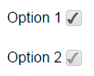

# deliteful/Checkbox

The `deliteful/Checkbox` widget represents a form-aware 2-state widget similar to the HTML5 input type="checkbox" element.
It provides all the standard facilities of a native input and supports deliteful theming capability.

*Example*



##### Table of Contents
[Element Instantiation](#instantiation)  
[Element Configuration](#configuration)  
[Element Styling](#styling)  
[Element Events](#events)  
[Enterprise Use](#enterprise)  
[See also](#seealso)  

<a name="instantiation"></a>
## Element Instantiation

See [`delite/Widget`](/delite/docs/master/Widget.md) for full details on how instantiation lifecycle is working.

### Declarative Instantiation

```html
<html>
  <label>
    <d-checkbox name="option1" checked="true"></d-checkbox>
    Option 1
  </label>
  <label>
    <d-checkbox name="option2"></d-checkbox>
    Option 2
  </label>
  <label>
    <d-checkbox disabled="true" name="option3"></d-checkbox>
    Option 3
  </label>
</html>
```

<iframe width="100%" height="150" allowfullscreen="allowfullscreen" frameborder="0"
src="http://jsfiddle.net/ibmjs/7sxarg93/embedded/result,html,js">
<a href="http://jsfiddle.net/ibmjs/7sxarg93/">checkout the sample on JSFiddle</a></iframe>

### Programmatic Instantiation

```js
  require([
    "deliteful/Checkbox"
  ], function (Checkbox) {
     var cb = new Checkbox({checked:true});
     cb.placeAt(document.body);
     cb = new Checkbox({disabled:true, name: "option1"});
     cb.placeAt(document.body);
});
```


<a name="configuration"></a>
## Element Configuration

The state of a Checkbox widget (checked or unchecked) is defined by the `checked` property, inherited from the
`deliteful/Toggle` class.

In addition, the Checkbox widget supports the following form-related properties of an HTML5 input element of
type "checkbox": `name`, `value`, `disabled` and `alt`, inherited from `delite/FormWidget`.

<a name="styling"></a>
## Element Styling

### Supported themes

This widget provides default styling for the following delite themes:

* bootstrap
* ios
* holodark

### CSS Classes

CSS classes are bound to the structure of the widget declared in its template `deliteful/Checkbox/Checkbox.html`.
The following table lists all the CSS classes that can be used to style the checkbox.

|class name/selector|applies to|
|----------|----------|
|d-checkbox|Checkbox widget node
|d-checkbox::before|Checkmark node

In addition, the following classes are used in combination with the classes above:

|class name/selector|applies to|
|----------|----------|
|d-checked|Checkbox and checkmark nodes in checked state
|d-focused|Checkbox widget node in focus state
|d-disabled|Checkbox and checkmark nodes in disabled state
|d-rtl|Checkbox and checkmark nodes in right-to-left configuration

<a name="events"></a>
## Element Events
The widget `deliteful/Checkbox` provides a `change` event when its state is changed following a user interaction.

|event name|dispatched|cancelable|bubbles|properties|
|----------|----------|----------|-------|----------|
|change|on state change|No |Yes|standard HTML5 Event propeties|

<a name="enterprise"></a>
## Enterprise Use
### Accessibility
|type|status|comment|
|----|------|-------|
|Keyboard|yes|Value is toggled when the space bar is pressed.|
|Visual Formatting|ok|Support high contrast on Firefox and Internet Explorer desktop browsers.|
|Screen Reader|yes|Tested with JAWS and VoiceOver|

### Browser Support
This widget supports all supported browsers without any degraded behavior.

<a name="seealso"></a>
## See also
### Samples
- deliteful/samples/Buttons.html
