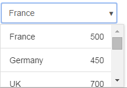

# deliteful/Combobox

`deliteful/Combobox` is a form-aware and store-aware widget leveraging the 
[`deliteful/list/List`](./list/List.md) widget for
displaying the list of options. 

Main features:
* Allows to benefit from the customization mechanism of the list item rendering.
* Provides single and multiple selection modes.
* Provides optional interactive filtering of list of options (single selection mode only). 
* Multichannel rendering.

*Example of deliteful/Combobox (single choice mode, on desktop browser):*



*Example of deliteful/Combobox (multiple choice mode, on mobile browser):*


##### Table of Contents
[Element Instantiation ](#instantiation)  
[Using Combobox](#using)  
[Element Styling](#styling)  
[Enterprise Use](#enterprise)


<a name="instantiation"></a>
## Element Instantiation

For details on the instantiation lifecycle, see [`delite/Widget`](/delite/docs/master/Widget.md).

### Declarative Instantiation

```js
require(["deliteful/Combobox", "requirejs-domready/domReady!"],
  function () {
  });
```

```html
<html>
  <d-combobox>
    <d-list>
    { "label": "France", ... },
      ...
    </d-list>
  </d-combobox>
</html>
```

<iframe width="100%" height="300" allowfullscreen="allowfullscreen" frameborder="0" 
src="http://jsfiddle.net/ibmjs/d1sj0fkp/embedded/result,js,html">
<a href="http://jsfiddle.net/ibmjs/d1sj0fkp/">checkout the sample on JSFiddle</a></iframe>


### Programmatic Instantiation


```js
require(["dstore/Memory", "dstore/Trackable",
         "deliteful/Combobox", "deliteful/list/List",
         "requirejs-domready/domReady!"],
  function (Memory, Trackable, Combobox, List) {
    // Create the store
    var dataSource = new (Memory.createSubclass(Trackable))({});
    // Add options
    dataSource.add(...);
    ...
    // Create the List
    var list = new List({source: dataSource, ...});
    // Create the Combobox
    var Combobox = new Combobox({list: list, selectionMode: "multiple"});
    Combobox.placeAt(document.body);
});
```

Or with an array in source property of the list :

```js
require(["decor/ObservableArray", "decor/Observable",
		 "deliteful/Combobox", "deliteful/list/List",
		 "requirejs-domready/domReady!"],
  function (ObservableArray, Observable, Combobox, List) {
    // Create the store
    var dataSource = new ObservableArray();
    // Add options
    dataSource.push(new Observable(...));
    ...
    // Create the List
    var list = new List({source: dataSource, ...});
    // Create the Combobox
    var Combobox = new Combobox({list: list, selectionMode: "multiple"});
    Combobox.placeAt(document.body);
});
```

<iframe width="100%" height="300" allowfullscreen="allowfullscreen" frameborder="0" 
src="http://jsfiddle.net/ibmjs/s2fzabtb/embedded/result,js,html">
<a href="http://jsfiddle.net/ibmjs/s2fzabtb/">checkout the sample on JSFiddle</a></iframe>


Note that the `list` property is set by default to a newly created instance of
`deliteful/list/List`. Hence, applications can write:

```js
    var combobox = new Combobox();
    // Create the store
    combobox.list.source = ...;
    ...
```

<a name="using"></a>
## Using Combobox

### Selection

The widget provides two selection modes through the `selectionMode` property: 
"single" (only one option can be selected at a time) and "multiple" (one or more
options can be selected).

Options can be selected programmatically using the `selectedItem` property (or, for multiple
selection mode, `selectedItems`) inherited from [`delite/Selection`](/delite/docs/master/Selection.md).


### Auto Filtering

In single selection mode, if the property `autoFilter` is set to `true` (default is `false`)
the widget allows to type one or more characters which are used for filtering 
the list of shown list items. By default, the filtering is case-insensitive, and an item
is shown if its label contains the entered string.

The default filtering policy can be customized using the `filterMode` and 
`ignoreCase` properties.

The valid values of `filterMode` are:
		 
* `"startsWith"`: the item matches if its label starts with the filter text.
* `"contains"`: the item matches if its label contains the filter text.
* `"is"`: the item matches if its label is the filter text.

The matching is case insensitive by default. Setting `ignoreCase` to `false` turns
it case sensitive.
 
The filtering is performed by the `filter(fitlerTxt)` method, which is called automatically 
while the user types into the editable input element, with `filterTxt` being the currently
entered text. The default implementation of this method uses `dstore/Filter.match()`.
The matching is performed against the `list.labelAttr` attribute of the source items.
The method can be overridden for implementing other filtering strategies.
		 
### Attribute Mapping

The customization of the mapping of source item attributes into render item attributes
can be done on the List instance using the mapping API of 
[`deliteful/list/List`](./list/List.md), as supported by its superclass
`delite/StoreMap`.

See the [`delite/StoreMap`](/delite/docs/master/StoreMap.md) documentation for
more information about the available mapping options, and the section
[`Store capabilities`](./list/List.md#store) of List's documentation.

### Multichannel rendering

The widget provides multichannel rendering: the popup is displayed on
large screens (desktop-like) below/above the main element, while on small and medium
screens (phone-like and tablet-like), to optimize the usage of the available space,
the popup is displayed in a centered overlay (an instance of `deliteful/Combobox/ComboPopup` 
is used in this case).

The channel is controlled by the value of the `has()` channel flags set by
`deliteful/features` using CSS media queries depending on the screen size.
See the [`deliteful/features`](./features.md) documentation
for information about how to configure the channel. Also, see the 
[`deliteful/channelBreakpoints`](./channelBreakpoints.md) documentation for information
about how to customize the values of the screen size breakpoints used by the media queries.

### Value and form support

The widget supports the following form-related properties: `value`, `name`, `disabled`
and `alt`, inherited from [`delite/FormWidget`](/delite/docs/master/FormWidget.md), and
`readOnly` inherited from [`delite/FormValueWidget`](/delite/docs/master/FormValueWidget.md).

The `value` property of the widget contains:
* Single selection mode: the value of the selected list items. By default, the
value of the first item is selected.
* Multiple selection mode: an array containing the values of the selected items.
Defaults to `[]`.

If the widget is used in an HTML form, the submitted value contains:
* Single selection mode: the same as widget's `value` property.
* Multiple selection mode: a string containing a comma-separated list of the values
of the selected items. Defaults to `""`.

By default, the `label` field of the List's render items is used as value of the item.
If the value needs to be different than the label, an attribute mapping needs to be
set for `value` on the `List` instance, for example:

```js
  // Create the store
  var dataSourceWithValue = new Memory({idProperty: "label",
	data: [
		{ label: "France", value: "FR" },
		{ label: "Germany", value: "DE" },
		...
	]});
    // Create the List and set valueAttr to specify the name of the field
    // which stores the value of the item (valueFunc can also be used
    // for dynamically computed values)
    var list = new List({source: dataSourceWithValue, valueAttr: "value", ...});
    // Create the Combobox
    var combobox = new Combobox({list: list, ...});
    combobox.placeAt(document.body);
```

or in markup:

```html
<html>
  <d-combobox>
    <d-list valueAttr="value">
    { "label": "France", "value": "FR" },
      ...
    </d-list>
  </d-combobox>
</html>
```

If no mapping is specified for `value`, the item label is used as value (itself subject to 
attribute mapping using `List.labelAttr` or `List.labelFunc`).


<a name="styling"></a>
## Element Styling

### Supported themes

This widget provides default styling for the following delite theme:

* bootstrap

### CSS Classes

CSS classes are bound to the structure of the widget declared in its template `deliteful/Combobox/Combobox.html`.
The following table lists the CSS classes that can be used to style the Combobox widget.

|Class name/selector|Applies to|
|----------|----------|
|d-combobox|Combobox widget root node.
|d-combobox-input|The native `<input>` nodes used by the Combobox widget.
|d-combobox-list|The List widget displayed inside the popup.
|d-combo-ok-button|The OK button used in some cases inside the popup.
|d-combo-cancel-button|The Cancel button used in some cases inside the popup.


<a name="enterprise"></a>
## Enterprise Use

### Accessibility

|type|status|comment|
|----|------|-------|
|Keyboard|ok|For details, see below this table.|
|Visual Formatting|ok|Tested for high constrast and browser zoom (200%), in IE and Firefox.|
|Screen Reader|ok|Tested on JAWS 15 and iOS VoiceOver.|

Keyboard navigation details:
* DOWN arrow opens the focused combobox.
* In single selection mode:
  * UP and DOWN arrows select the next, respectively the previous option.
  * RETURN and ESCAPE validate the change.
* In multiple selection mode:
  * UP and DOWN arrows navigate to the next, respectively the previous option.
  * SPACE toggles the selected state of the currently navigated option.
  * RETURN and ESCAPE validate the change.

### Globalization

`deliteful/Combobox` provides an internationalizable bundle that contains the following
messages:
		
|Key|Role|
|----------|----------|
|"multiple-choice"|Text written in the combo in multiple selection mode if more than one item is selected.
|"multiple-choice-no-selection"|Text written in the combo in multiple selection mode if no item is selected.
|"search-placeholder"|Set as placeholder attribute of the input element used for filtering the list of options.
|"ok-button-label"|The label of the OK button used for multiple selection mode on mobile.
|"cancel-button-label"|The label of the Cancel button used for multiple selection mode on mobile.

The first 3 strings in the table above are used as default values for the widget properties 
`multipleChoiceMsg`, `multipleChoiceNoSelectionMsg`, and respectively `searchPlaceHolder`.
To customize these strings on a per-widget basis, set directly these properties.

Right to left orientation is supported by setting the `dir` attribute to `rtl` on the
widget. 

### Security

This class has no specific security concern.

### Browser Support

This class supports all supported browsers.
