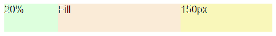

# deliteful/LinearLayout

``deliteful/LinearLayout`` is a CSS layout container based on the [CSS3 Flexible Box Layout Module](http://www.w3.org/TR/css3-flexbox/).
The children of a ``deliteful/LinearLayout`` container can be laid out horizontally or vertically, and can fill unused space.

##### Table of Contents
[Element Instantiation](#instantiation)  
[Element Configuration](#configuration)   
[Element Styling](#styling)  
[Enterprise Use](#enterprise)  
  
<a name="instantiation"></a>
## Element Instantiation

See [`delite/Widget`](/delite/docs/master/Widget.md) for full details on how instantiation lifecycle is working.

### Declarative Instantiation

```js
require(["deliteful/LinearLayout", "requirejs-domready/domReady!"], function () {
});
```

```html
<html>
  <d-linear-layout vertical="false" style="width:100%, height:50px">
    <div style="width: 20%">Left (20%)</div>
    <div class="fill">Center (Fill Space)</div>
    <div style="width: 50px">Right (50px)</div>
  </d-linear-layout>
</html>
```

### Programmatic Instantiation

```js
require(["deliteful/LinearLayout", "requirejs-domready/domReady!"], function (LinearLayout) {
  var layout = new LinearLayout({vertical: false});
  layout.style.width = "100%";
  var leftChild = document.createElement("div");
  var centerChild = document.createElement("div");
  var rightChild = document.createElement("div");
  leftChild.style.width = "20%";
  centerChild.class = "fill";
  rightChild.style.width = "50px";
  layout.addChild(leftChild);
  layout.addChild(centerChild);
  layout.addChild(rightChild);
  layout.placeAt(document.body);
});
```

<a name="configuration"></a>
## Element Configuration

### Properties

The layout direction is controlled by the `vertical` property which is `true` by default.

The *main* direction of a LinearLayout is controlled by the ``vertical`` property which is true by default.
The direction perpendicular to the *main* axis is called the *cross* direction. For example, if the *main* direction is vertical, *the cross* direction is horizontal.

### Setting the *main* size of children

In the *main* direction, children of a LinearLayout widget support the following sizing constraints:

| Constraint                            | Example              |
| ------------------------------------- | -------------------  |
| Natural Size (no size set explicitly) |                      |
| Fixed Size                            | style="width: 150px" |
| Percentage Size                       | style="width: 30%"   |
| *Fill Available Space*                | class="fill"         |

These constraints can be mixed together for children of the same container.



<iframe width="100%" height="300" allowfullscreen="allowfullscreen" frameborder="0" 
src="http://jsfiddle.net/ibmjs/CcbY6/embedded/result,html,css,js">
<a href="http://jsfiddle.net/ibmjs/CcbY6/">checkout the sample on JSFiddle</a></iframe>

### Setting the *cross* size of children

If nothing specified, a child fill its parent in the *cross* direction. If the *cross* size of the LinearLayout is set, you can specify a percentage size for the cross size of children.
The *cross* size of a child can be also a fixed size.

<iframe width="100%" height="300" allowfullscreen="allowfullscreen" frameborder="0" 
src="http://jsfiddle.net/ibmjs/Trz2m/embedded/result,html,css,js">
<a href="http://jsfiddle.net/ibmjs/Trz2m/">checkout the sample on JSFiddle</a></iframe>

### Nesting LinearLayout containers

Nesting LinearLayout instances can be used to build layouts in two dimensions.

<iframe width="100%" height="300" allowfullscreen="allowfullscreen" frameborder="0" 
src="http://jsfiddle.net/ibmjs/PY6Lz/embedded/result,html,css,js">
<a href="http://jsfiddle.net/ibmjs/PY6Lz/">checkout the sample on JSFiddle</a></iframe>

### Getting the sub-child of a LinearLayout to fill 100% in height

If you set ``style="width:100%; height:100%"`` or ``class="width100 height100"`` (defined in [`defaultapp.css`](/delite/docs/master/defaultapp.md)) on a LinearLayout sub-child and if its computed height is greater than its parent height, it will be displayed out of bounds of the container.
To avoid this behaviour, you must add ``position: absolute`` on the sub-child.

<iframe width="100%" height="300" allowfullscreen="allowfullscreen" frameborder="0" 
src="http://jsfiddle.net/ibmjs/aYj4A/embedded/result,html,css,js">
<a href="http://jsfiddle.net/ibmjs/aYj4A/">checkout the sample on JSFiddle</a></iframe>

### Getting equal-size children in the *main* direction

You just have to set the ``fill`` class on all children.

<iframe width="100%" height="300" allowfullscreen="allowfullscreen" frameborder="0"
src="http://jsfiddle.net/ibmjs/t95cokr5/embedded/result,html,css,js">
<a href="http://jsfiddle.net/ibmjs/t95cokr5/">checkout the sample on JSFiddle</a></iframe>

### Examples

<iframe width="100%" height="300" allowfullscreen="allowfullscreen" frameborder="0" 
src="http://jsfiddle.net/ibmjs/2gmxgm3w/embedded/result,html,css,js">
<a href="http://jsfiddle.net/ibmjs/2gmxgm3w/">Header / Stretched List / Footer</a></iframe>

<a name="styling"></a>
## Element Styling

LinearLayout has no visual appearance, it does not provide any CSS class for styling.

If `vertical` is `true`, the height of LinearLayout must be explicitly set, otherwise the width must be explictly set.

To set the height of a LinearLayout using a percentage expression, the height of all its ancestors (including `<body>`) must also be expressed as percentage.

### CSS Good Practices

   * LinearLayout CSS ``position`` property should not be changed.
   * Direct children of a LinearLayout have their CSS `position` attribute set to `relative`. This should not be changed.
   * Setting padding for both the LinearLayout and its children is discouraged since it's not well supported on Firefox.
   * Using ``position:absolute``, `top`, `right`, `bottom` and `left` for the position/size of content inside a direct children of LinearLayout
   is discouraged since it's not supported on some Android stock browser.
   * Setting ``display:inline-flex`` on a LinearLayout is discouraged since it's not well supported on Safari iOS and
     Android stock browsers.

<a name="enterprise"></a>
## Enterprise Use

### Accessibility

Relies on browser.

### Globalization

`deliteful/LinearLayout` does not provide any internationalizable bundle.

Right to left orientation is supported by setting the `dir` attribute to `rtl` on the LinearLayout element:

```html
<d-linear-layout dir="rtl"></d-linear-layout>
```

### Security

This widget has no specific security concern. Refer to `delite/Widget` documentation for general security advice on this base class that LinearLayout is using.

### Browser Support

This widget supports all supported browsers except Internet Explorer 9.

