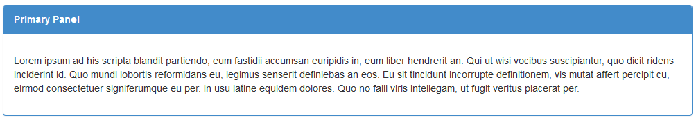

# deliteful/Panel

`deliteful/Panel` is a container widget with a Title Bar on top, that uses CSS3 Flexible box to always show the title and fill the available
space with its children.



##### Table of Contents
[Element Instantiation](#instantiation)  
[Element Configuration](#configuration)  
[Element Styling](#styling)  
[User Interactions](#interactions)  
[Element Events](#events)  
[Enterprise Use](#enterprise)  

<a name="instantiation"></a>
## Element Instantiation

See [`delite/Widget`](/delite/docs/master/Widget.md) for full details on how instantiation lifecycle works.

### Declarative Instantiation

```js
require(["deliteful/Panel", "requirejs-domready/domReady!"], function () {
});
```

```html
<html>
	<d-panel id="panel">
		<div>Content - Panel</div>
	</d-panel>
</html>
```

### Programmatic Instantiation

```js
require([
	"deliteful/Panel", "requirejs-domready/domReady!"
], function(Panel) {
	var panel = new Panel({label: "panel"});
	var content = document.createElement("div");
	panel.addChild(content);
    panel.placeAt(document.body);
});
```

<a name="configuration"></a>
## Element Configuration
The following properties can be set on the widget to configure it:

* `label`: the label to display in the panel header;
* `iconClass`: CSS class to apply to a DOM node before the label in order to render an icon;
* `closedIconClass`: this CSS class is only used when the panel is inside a [`deliteful/Accordion`](/deliteful/docs/master/Accordion.md)
and it is used to display an icon when the panel is closed.

`deliteful/Panel` support `delite` container infrastructure by inheriting from `delite/Container`.
For more informations, see [`delite/Container`](/delite/docs/master/Container.md) documentation.

<a name="styling"></a>
## Element Styling

### Widget CSS Classes

The following CSS classes are automatically set by the widget and can be reused for overriding the default style.

CSS Class          | Description
-----------------  | -------------
`d-panel`          | The panel container
`d-panel-header`   | The title bar
`d-panel-content`  | The content of the panel

### Styling CSS classes

The following CSS classes provided by the widget can be set explicitly on the element itself:

CSS Class          | Description
-------------------| -------------
`d-panel-success`  | Indicates a successful or positive information
`d-panel-info`     | Indicates a neutral informative change or information
`d-panel-warning`  | Indicates a warning that might need attention
`d-panel-danger`   | Indicates a dangerous or potentially negative information

<a name="interactions"></a>
## User Interactions
`deliteful/Panel` does not provide any predefined interactions.

<a name="enterprise"></a>
## Enterprise Use

### Accessibility

|type|status|comment|
|----|------|-------|
|Keyboard|N/A|No user interaction|
|Visual Formatting|ok|Supports high contrast on Firefox and Internet Explorer desktop browsers.|
|Screen Reader|ok|Title bar has an ARIA role of `heading` and content has an ARIA role of `region`. Tested with JAWS and VoiceOver|

### Globalization

`deliteful/Panel` does not provide any internationalizable bundle.

### Security

This widget has no specific security concern. Refer to [`delite/Widget`](/delite/docs/master/Widget.md) for general security advice on this base class.

### Browser Support

This widget supports all supported browsers.