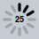
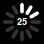

# deliteful/ProgressIndicator

The `deliteful/ProgressIndicator` widget indicates that a task is ongoing. It displays a round spinning graphical
representation. For a task whose end is determined, you can provide a number from 0 to 100 to indicate the level of 
progression.

*Overview of the Progress Indicator by theme (bootstrap, iOS, Holodark)*






##### Table of Contents
[Element Instantiation](#instantiation)  
[Element Configuration](#configuration)  
[Element Styling](#styling)  
[Enterprise Use](#enterprise)  
[See also](#seealso)

<a name="instantiation"></a>
## Element Instantiation

See [`delite/Widget`](/delite/docs/master/Widget.md) for full details on how instantiation lifecycle is working.

### Declarative Instantiation

```html
<html>
  <d-progress-indicator id="pi" active="true"></d-progress-indicator>
</html>
```
ProgressIndicator must be active to become visible and start its animation.

```js
  require([
    "deliteful/ProgressIndicator"
  ], function () {
     // perform some tasks...
     // then deactivate the progress indicator
     var pi = document.getElementById("pi");
     pi.active = false;
});
```

### Programmatic Instantiation

```js
  require([
    "deliteful/ProgressIndicator"
  ], function (ProgressIndicator) {
     var pi = new ProgressIndicator({active: true});
     pi.placeAt(document.body);

     //do some other tasks (load data...)

     pi.active = false;
     pi.destroy(); //this instance won't be reused, so destroy it.
});
```

<a name="configuration"></a>
## Element Configuration

The following properties can be set on the widget to configure it:

* `active`: Set to false to hide the widget and stop any ongoing animation. Set to true to show the widget: animation
automatically starts unless you set a number to the "value".
* `value`: A value from 0 to 100 that indicates a percentage of progression of an ongoing task. Defaults to NaN.
* `speed`: The relative speed of the spinning animation. Accepted values are "slow", "normal" and "fast". Other values
are converted to "normal".

### Determinate vs indeterminate
ProgressIndicator is indeterminate as long as `ProgressIndicator.value = NaN`, which is the default value.
`deliteful/ProgressIndicator` is indeterminate in the sense that it doesn't indicate the level of completion
of the ongoing task, it will spin until it is deactivated.

<iframe width="100%" height="300" allowfullscreen="allowfullscreen" frameborder="0" 
src="http://jsfiddle.net/ibmjs/58rt6/embedded/result,js,html">
<a href="http://jsfiddle.net/ibmjs/58rt6/">checkout the sample on JSFiddle</a></iframe>

### Animation speed
The `speed` attribute lets you change the relative speed of the animation. Accepted values are "slow", "normal"
and "fast". Other values are converted to "normal". Note that the actual/real speed of the animation depends of the
device/os/browser capabilities.

<a name="styling"></a>
## Element Styling
### Supported themes

This widget provides default styling for the following delite themes:

* bootstrap
* ios
* holodark

### CSS Classes
Style is defined by the CSS classes from the themes of the widget. CSS classes are bound to the
structure of the widget declared in its template `deliteful/ProgressIndicator/ProgressIndicator.html`

|class name|applies to|
|----------|----------|
|d-progress-indicator|the ProgressIndicator widget node|
|d-progress-indicator text|the child node which contains the text to display when a value is set|
|d-progress-indicator-lines|the child node which declare the 12 lines of the ProgressIndicator| 

### Customizing the colors
Here is an example that shows how to set the lines and the text in red:

```html
<html>
  <d-progress-indicator id="pi"></d-progress-indicator>
</html>
```

```css
#pi .d-progress-indicator-lines {
  stroke: red;
}
#pi.d-progress-indicator text {
  fill: red;
}
```

<iframe width="100%" height="150" allowfullscreen="allowfullscreen" frameborder="0" 
src="http://jsfiddle.net/ibmjs/WALnB/embedded/result,html,css">
<a href="http://jsfiddle.net/ibmjs/WALnB/">checkout the sample on JSFiddle</a></iframe>

### Customizing the size
Default widget size is 40x40px on all themes. You may use `width` and `height` standard CSS properties to specify the
size. We recommend that you keep `width` and `height` equal (or close) in order to get nicer results.

*Example of ProgressIndicator which fills its container*

```html
<d-progress-indicator style="width: 100%; height: 100%"></d-progress-indicator>
```
<iframe width="100%" height="200" allowfullscreen="allowfullscreen" frameborder="0" 
src="http://jsfiddle.net/ibmjs/qhSdW/embedded/result,html">
<a href="http://jsfiddle.net/ibmjs/qhSdW/WALnB/">checkout the sample on JSFiddle</a></iframe>

Note the the text size automatically stretch/expand itself, so you do not have to set/change the font size.

<a name="enterprise"></a>
## Enterprise Use
### Accessibility
|type|status|comment|
|----|------|-------|
|Keyboard|N/A|No user interaction|
|Visual Formatting|ok|Support high contrast on Firefox and Internet Explorer desktop browsers.|
|Screen Reader|no|There is no ARIA role for progress indicator, for long running tasks that require sounds feedback, consider using `deliteful/ProgressBar`|

### Browser Support
This widget supports all supported browsers without any degraded behavior.

<a name="seealso"></a>
## See also
### Samples
- deliteful/samples/ProgressIndicator-basic.html
- deliteful/samples/ProgressIndicator-overlay.html
- deliteful/samples/ProgressIndicator-percentage.html
