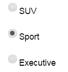

# deliteful/RadioButton

The `deliteful/RadioButton` widget represents a 2-state widget similar to the HMTL5 input type="radio" element.
Contrary to other checkbox widgets like `deliteful/Checkbox` or `deliteful/Switch`, a RadioButton is usually used with
other RadioButton widgets to form a group of exclusive options. Only one RadioButton can be checked at a time within a
group.

*Example of RadioButton widgets* 



##### Table of Contents
[Element Instantiation](#instantiation)  
[Element Configuration](#configuration)  
[Element Styling](#styling)  
[Element Events](#events)  
[Enterprise Use](#enterprise)  
[See also](#seealso)

<a name="instantiation"></a>
## Element Instantiation

See [`delite/Widget`](/delite/docs/master/Widget.md) for full details on how instantiation lifecycle is working.

### Declarative Instantiation

```html
<html>
  <body>
    <d-radio-button checked="true" name="category" value="SUV"></d-radio-button>
    <d-radio-button name="category" value="Sport"></d-radio-button>
    <d-radio-button name="category" value="Executive"></d-radio-button>
  </body>
</html>
```

Check the following jsfiddle example:
<iframe width="100%" height="300" src="http://jsfiddle.net/ibmjs/p22Lj0fn/embedded/result,html,css,js" 
allowfullscreen="allowfullscreen" frameborder="0">
<a href="http://jsfiddle.net/ibmjs/p22Lj0fn/">checkout the sample on JSFiddle</a></iframe>

### Programmatic Instantiation

```js
  require([
    "deliteful/RadioButton"
  ], function (RadioButton) {
     var sw = new RadioButton({checked:true, name: "category", value: "SUV"});
     sw.placeAt(document.body);
     sw = new RadioButton({name: "category", value: "Sport"});
     sw.placeAt(document.body);
     sw = new RadioButton({name: "category", value: "Executive"});
     sw.placeAt(document.body);
});
```

<a name="configuration"></a>
## Element Configuration

A RadioButton widget is used in relation with other RadioButton widgets to form a group of exclusive choices. A radio
button group is defined as a logical group of RadioButton widgets that share the same `name` attribute value. When a
form is submitted, only the value of the checked RadioButton is submitted.

The state of a RadioButton widget (checked or unchecked) is defined by the `checked` property, inherited from the 
`deliteful/Toggle` class. There can be only one RadioButton checked within a radio button group.

In addition, the Switch widget supports the following form-related properties of an HTML5 input element of 
type "checkbox": `name`, `value`, `disabled` and `alt`, inherited from `delite/FormWidget`.

<a name="styling"></a>
## Element Styling

### Supported themes

This widget provides default styling for the following delite themes:

* bootstrap

### CSS Classes

CSS classes are bound to the structure of the widget declared in its template `deliteful/RadioButton/RadioButton.html`.
The following table lists all the CSS classes that can be used to style the widget. 

|class name/selector|applies to|
|----------|----------|
|d-radio-button|RadioButton widget node
|d-radio-button::before|RadioButton "reticule"
In addition, the following classes are used in combination with the classes above:

|class name/selector|applies to|
|----------|----------|
|d-checked|RadioButton widget node in checked state
|d-focused|RadioButton widget node in focus state

<a name="events"></a>
## Element Events
The widget `deliteful/RadioButton` emits a `change` event when its checked state is changed following a user interaction.

|event name|dispatched|cancelable|bubbles|properties|
|----------|----------|----------|-------|----------|
|change|on state change|No |Yes|standard HTML5 Event properties|

<a name="enterprise"></a>
## Enterprise Use

### Accessibility
|type|status|comment|
|----|------|-------|
|Keyboard|N/A|No user interaction|
|Visual Formatting|ok|Support high contrast on Firefox and Internet Explorer desktop browsers.|
|Screen Reader|yes|Supports ARIA role radio. Tested with JAWS and VoiceOver|

### Globalization

`deliteful/RadioButton` does not provide any internationalizable bundle.

### Browser Support
This widget supports all supported browsers without any degraded behavior.

### Security

This class has no specific security concern.

<a name="seealso"></a>
## See also
### Samples
- deliteful/samples/Buttons.html
