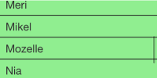

# deliteful/ScrollableContainer

`deliteful/ScrollableContainer` is a container widget with scrolling capabilities.
This widget which can scroll its contents horizontally and/or vertically. 
Its scrolling capabilities and API are provided by its parent class 
[`delite/Scrollable`](/delite/docs/master/Scrollable.md).

*Example of deliteful/ScrollableContainer on mobile:*



*Example of deliteful/ScrollableContainer on desktop:*


##### Table of Contents
[Element Instantiation ](#instantiation)  
[Using ScrollableContainer](#using)  
[Element Styling](#styling)  
[User Interactions](#interactions)  
[Events](#events)  
[Extending ScrollableContainer](#extending)  
[Enterprise Use](#enterprise)


<a name="instantiation"></a>
## Element Instantiation

For details on the instantiation lifecycle, see [`delite/Widget`](/delite/docs/master/Widget.md).

### Declarative Instantiation

```js
require(["deliteful/ScrollableContainer", 
         "requirejs-domready/domReady!"
        ], function () {
});
```

```html
<html>
  <d-scrollable-container scrollDirection="both">
    <div>...</div>
    <div>...</div>
  </d-scrollable-container>
</html>
```

<iframe width="100%" height="300" allowfullscreen="allowfullscreen" frameborder="0" 
src="http://jsfiddle.net/ibmjs/k68f4/embedded/result,js,html">
<a href="http://jsfiddle.net/ibmjs/k68f4/">checkout the sample on JSFiddle</a></iframe>


### Programmatic Instantiation

```js
require([
  "deliteful/ScrollableContainer"
  ], function (ScrollableContainer) {
    var sc = new ScrollableContainer({scrollDirection: "both"});
    sc.placeAt(document.body);

    // add content to the scrollable container:
    var child = document.createElement("div");
    sc.addChild(child);
    
    // If needed, listen to native "scroll" events:
    sc.on("scroll", function (event) {
      ...
    });
});
```

<iframe width="100%" height="300" allowfullscreen="allowfullscreen" frameborder="0" 
src="http://jsfiddle.net/ibmjs/RuqVK/embedded/result,js,html">
<a href="http://jsfiddle.net/ibmjs/RuqVK/">checkout the sample on JSFiddle</a></iframe>


<a name="using"></a>
## Using ScrollableContainer

By default, the scrolling capabilities are added to the widget's root node
(that is, the widget itself). A sublcass of `deliteful/ScrollableContainer`
can chose the node thanks to the property `scrollableNode`.
This property must be set by the subclass at latest in its `render()`
method.

### Scroll Direction

The widget provides several scrolling modes through the `scrollDirection` property.
For details, see [`Using delite/Scrollable`](/delite/docs/master/Scrollable.md#using).

### Programmatic Scroll

In additional to the interactive scroll, the API of `deliteful/ScrollableContainer` provides methods 
for programmatic scroll. For details, see [`Using delite/Scrollable`](/delite/docs/master/Scrollable.md#using).


<a name="events"></a>
## Element Events

During interactive or programmatic scrolling, native "scroll" events are emitted.
For details, see [`Events in delite/Scrollable`](/delite/docs/master/Scrollable.md#events).


<a name="styling"></a>
## Element Styling

Style is defined by the CSS classes from the themes of the widget.
In addition to the CSS classes defined by the superclass `delite/Scrollable`
(see [`Element Styling in delite/Scrollable`](/delite/docs/master/Scrollable.md#styling), 
`deliteful/ScrollableContainer` adds an empty marker class `d-scrollable-container`.


<a name="interactions"></a>
## User Interactions

The scrolling interaction is handled natively by the browser in a multi-channel 
responsive manner. For details, see [`Interactions in delite/Scrollable`](/delite/docs/master/Scrollable.md#interactions).


<a name="extending"></a>
## Extending ScrollableContainer

By default, the scrolling capabilities are added to the widget's root node
(that is, the widget itself). A sublcass of `deliteful/ScrollableContainer`
can chose the node thanks to the property `scrollableNode`.
This property must be set by the subclass at latest in its `render()`
method.

*First use-case: creating a widget extending `deliteful/ScrollableContainer`*

```js
define(["delite/register", "deliteful/ScrollableContainer", ...],
  function (register, Scrollable, ...) {
    return register("mywidget", [HTMLElement, ScrollableContainer, ...], {
      ...
      render: dcl.superCall(function (sup) {
        return function () {
          // Create a child element:
          var myScrollableDiv = document.createElement("div");
          ...
          this.appendChild(myScrollableDiv);
          // Indicate the scrollable child element:
          this.scrollableNode = myScrollableDiv; 
          sup.apply(this, arguments);
        };
      })
});
```

Characteristics:

- Fits for widgets with one single scrollable element.
- Exposes the API of the parent classes, including the scrolling API of `delite/Scrollable`.

*Second use-case: creating a widget embedding widgets extending `deliteful/ScrollableContainer`*

```js
define(["delite/register", "deliteful/ScrollableContainer", ...],
  function (register, Scrollable, ...) {
    // In this use-case, does not extend delite/Scrollable
    // nor deliteful/ScrollableContainer
    return register("mywidget", [HTMLElement, ...], {
      ...
      render: dcl.superCall(function (sup) {
        return function () {
          var scrollableNode =
            // or your own scrollable widget
            new ScrollableContainer(...);
          ...
          this.appendChild(scrollableNode);
          // If needed, add other scrollable widgets as child elements
          sup.apply(this, arguments);
        };
      })
});
```

Characteristics:

- Allows a widget to have more than one scrollable element.
- Allows to hide the API of the parent classes, including the scrolling API of `delite/Scrollable`.


<a name="enterprise"></a>
## Enterprise Use

`deliteful/ScrollableContainer`'s characteristics in terms of accessibility, 
globalization, security, and browser support are similar to those of `delite/Scrollable`. 
For details, see 
[`Enterprise Use of delite/Scrollable`](/delite/docs/master/Scrollable.md#interactions).
