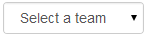

# deliteful/Select

`deliteful/Select` is a form-aware and store-aware widget leveraging the native 
[HTML5 select element](http://www.w3.org/TR/html5/forms.html#the-select-element).

*Example of deliteful/Select (single choice mode):*



*Example of deliteful/Select (multiple choice mode):*


##### Table of Contents
[Element Instantiation ](#instantiation)  
[Using Select](#using)  
[Element Styling](#styling)  
[Enterprise Use](#enterprise)


<a name="instantiation"></a>
## Element Instantiation

For details on the instantiation lifecycle, see [`delite/Widget`](/delite/docs/master/Widget.md).

### Declarative Instantiation

```js
require(["delite/register", "deliteful/Store", "deliteful/Select", "requirejs-domready/domReady!"],
  function (register) {
    register.parse();
});
```

```html
<html>
  <d-store id="myStore">
    {text: "Option 1", value: "1"},
    ...
  </d-store>
  <d-select selectionMode="multiple" id="select1" store="myStore"></d-select>
</html>
```

<iframe width="100%" height="300" allowfullscreen="allowfullscreen" frameborder="0" 
src="http://jsfiddle.net/ibmjs/nqM5G/embedded/result,js,html">
<a href="http://jsfiddle.net/ibmjs/nqM5G/">checkout the sample on JSFiddle</a></iframe>


### Programmatic Instantiation

```js
require(["delite/register", "dstore/Memory", "dstore/Trackable",
         "deliteful/Select", "requirejs-domready/domReady!"],
  function (register, Memory, Trackable) {
    register.parse();
    var select = new Select({selectionMode: "multiple"});
    // Create the store
    var store = new (Memory.createSubclass(Trackable))({});
    select.store = store;
    // add options to the Select widget
    store.add({text: "Option 1", value: "1"});
    ...
    select.placeAt(document.body);
    select.startup();
});
```

<iframe width="100%" height="300" allowfullscreen="allowfullscreen" frameborder="0" 
src="http://jsfiddle.net/ibmjs/59LP6/embedded/result,js,html">
<a href="http://jsfiddle.net/ibmjs/59LP6/">checkout the sample on JSFiddle</a></iframe>


<a name="using"></a>
## Using Select

### Selection Mode

The widget provides several selection modes through the `selectionMode` property
inherited from `delite/Selection`.
For details, see [`Using delite/Selection`](/delite/docs/master/Selection.md#using).

Note that `deliteful/Select` only supports for this property the values `single` and
`multiple`.

### Attribute Mapping

`deliteful/Select` uses two attributes of data store items: the `text` attribute for
the label of the option elements, and `value` for their value attribute.
Because the widget inherits from [`delite/StoreMap`](/delite/docs/master/StoreMap.md), 
the mapping between the attributes of the data store items and the attributes used by 
`deliteful/Select` can be redefined using the `labelAttr` and `valueAttr` properties,
or using a `labelFunc` and `valueFunc`. See the 
[`delite/StoreMap`](/delite/docs/master/StoreMap.md) documentation for more
information about the available mapping options.


<a name="styling"></a>
## Element Styling

### Supported themes

This widget provides default styling for the following delite theme:

* bootstrap

### CSS Classes

CSS classes are bound to the structure of the widget declared in its template `deliteful/Select/Select.html`.
The following table lists the CSS classes that can be used to style the Select widget.

|class name/selector|applies to|
|----------|----------|
|d-select|Select widget node
|d-select-inner|The inner native HTML `<select>`

In addition, the following class is used in combination with the classes above:

|class name/selector|applies to|
|----------|----------|
|d-select-focus|Select widget in focus state

Note that level of support for styling the inner native HTML `<select>` (and 
particularly its `<option>` children) is browser-dependent.

<a name="enterprise"></a>
## Enterprise Use

### Accessibility

Keyboard accessibility is supported. All supported desktop browsers provide keyboard accessibility
for elements using the native 
[HTML5 select element](http://www.w3.org/TR/html5/forms.html#the-select-element).

Screen reader accessibility relies on screen reader's ability to work with HTML elements using the 
native [HTML5 select element](http://www.w3.org/TR/html5/forms.html#the-select-element).

### Globalization

`deliteful/Select` does not provide any internationalizable bundle. The only strings displayed 
by the widget are coming from the user data through the store from which the options are retrieved.

Right to left orientation is supported by setting the `dir` attribute to `rtl` on the
widget.

### Security

This class has no specific security concern.

### Browser Support

This class supports all supported browsers.
