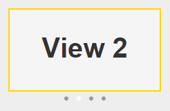

# deliteful/ViewIndicator

`deliteful/ViewIndicator` is a companion widget to `deliteful/ViewStack` (or its subclass `deliteful/SwapView`) that
shows which child of the ViewStack is currently visible. It displays a set of small dots corresponding to the
children of the ViewStack. The dot representing the visible child is white while the other dots are gray.



<iframe width="100%" height="300" allowfullscreen="allowfullscreen" frameborder="0" 
src="http://jsfiddle.net/ibmjs/kd1qj9bw/embedded/result,html,css,js">
<a href="http://jsfiddle.net/ibmjs/kd1qj9bw/">checkout the sample on JSFiddle</a></iframe>

##### Table of Contents
[Element Instantiation](#instantiation)  
[Element Configuration](#configuration)  
[Element Styling](#styling)  
[User Interactions](#interactions)  
[Enterprise Use](#enterprise)

<a name="instantiation"></a>
## Element Instantiation

When creating a ViewIndicator, you must specify which ViewStack it is associated with using the `viewStack` property.

See [`delite/Widget`](/delite/docs/master/Widget.md) for full details on how instantiation lifecycle is working.

### Declarative Instantiation

```js
require(["deliteful/SwapView", "deliteful/ViewIndicator", "requirejs-domready/domReady!"],
  function () {}
);
```

```html
<html>
  <d-swap-view id="sv" style="width:100%; height:200px">
    <div style="background-color: darkblue">Child 1 (Default visible child)</div>
    <div style="background-color: white">Child 2</div>
    <div style="background-color: crimson">Child 3</div>
  </d-swap-view>
  <d-view-indicator viewstack="sv" style="width:100%"></d-view-indicator>
</html>
```

### Programmatic Instantiation

```js
require(["deliteful/SwapView", "deliteful/ViewIndicator", "requirejs-domready/domReady!"],
function (SwapView, ViewIndicator) {
  var sv = new SwapView({style: "width:100%; height: 200px"});
  var child1 = document.createElement("div");
  var child2 = document.createElement("div");
  var child3 = document.createElement("div");
  sv.addChild(child1);
  sv.addChild(child2);
  sv.addChild(child3);
  sv.placeAt(document.body);
  var vi = new ViewIndicator({viewStack: sv, style: "width:100%"});
  vi.placeAt(document.body);
});
```

<a name="configuration"></a>
## Element Configuration

### Properties

The `viewStack` property must be set to a `deliteful/ViewStack` or `deliteful/SwapView` id or instance.
The ViewIndicator will track visibility changes of the children of the specified ViewStack and update
its display
accordingly.

<a name="styling"></a>
## Element Styling

### Supported themes

This widget provides default styling for the following delite themes:

* bootstrap
* ios
* holodark

### CSS Classes

The dots can be customized using the following CSS classes:

* `-d-view-indicator-dot` is added to all dots,
* `-d-view-indicator-dot-selected` is added to the dot representing the visible child.

For example, the following rules would give a square shape to the dots and make the selected dot red:
```css
.d-view-indicator .-d-view-indicator-dot {
	-moz-border-radius: 0;
	border-radius: 0;
}
.d-view-indicator .-d-view-indicator-dot-selected {
	background-color: red;
}
```

<a name="interactions"></a>
## User Interactions

Clicking or touching a dot shows the corresponding child in the ViewStack. If the ViewIndicator is large enough 
(which depends on how it is laid out in the HTML page), clicking in the empty area on the right of the dots shows
 the next child in the ViewStack, and clicking on the left of the dots shows the previous child.

<a name="enterprise"></a>
## Enterprise Use

### Accessibility

ViewIndicator does not provide accessibility support, as the ViewStack is already accessible through the Page Up /
Down keys.

### Globalization

`deliteful/ViewIndicator` does not provide any internationalizable bundle.

Right to left orientation is supported by setting the `dir` attribute to `rtl` on the `deliteful/ViewIndicator` element.
This affects clicks outside of the dots: in right-to-left mode, clicking in the empty area on the right of the dots
shows the previous child in the ViewStack, and clicking on the left of the dots shows the next child.

### Security

This widget has no specific security concern. Refer to [`delite/Widget`](/delite/docs/master/Widget.md) for general security advice on this base class that `deliteful/ViewIndicator` is using.

### Browser Support

This widget supports all supported browsers.
