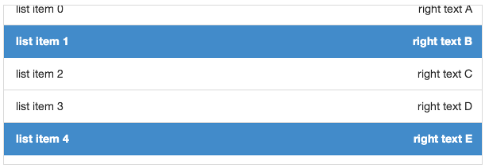

# deliteful/list/List


The `deliteful/list/List` custom element (`d-list` custom tag) renders an optionally scrollable list of items that 
are retrieved from an array or a store object from the [dstore](http://dstorejs.io/) project.

The list inherits from the [`delite/Store`](/delite/docs/master/Store.md) class and as such any valid `dstore/Store` 
implementation can be used to provide data to the list. No store is provided by default and the application developer 
has to provide one created either programmatically or in markup.

Items rendered by the list are standard javascript objects. The list delegates the rendering of its items to an _item renderer_ widget.

The default item renderer implementation (`deliteful/list/ItemRenderer`) renders objects that define any of the following properties:

* `label`: the label of the item, displayed on the left (or on the right if direction is right to left)
* `righttext`: a text to display on the right (or on the left if direction is right to left)
* `iconclass`: css class to apply to a div before the label in order to display an icon
* `righticonclass`: css class to apply to a div after the right text in order to display an icon

Here is a screenshot of a list that displays items using the default renderer:


Any [custom item renderer](#customRenderers) can be specified  using the `itemRenderer` property of the widget.

The widget also provides the following capabilities:

* List items can be grouped into categories (see [Categorized items](#categories));
* List items can be selectable (see [Selection support](#selection));
* For maximum flexibility, both `grid`, `listbox`, and `menu` WAI-ARIA roles are supported
  (see [Accessibility](#accessibility)).

##### Table of Contents
[Element Instantiation](#instantiation)  
[Element Configuration](#configuration)  
[Element Styling](#styling)  
[User Interactions](#interactions)  
[Mixins](#mixins)  
[Element Events](#events)  
[Enteprise Use](#enterprise)  

<a name="instantiation"></a>
## Element Instantiation

See [`delite/Widget`](/delite/docs/master/Widget.md) for full details on how instantiation lifecycle is working.

### Declarative Instantiation

```html
<!-- A list of categorized items that uses the default item renderer, -->
<!-- mapping the sales property of items to righttext, and using the -->
<!-- region property as the item category. The store is referenced through -->
<!-- the source property -->
<d-list righttextAttr="sales" categoryAttr="region">
    <!-- Add the following items to the store -->
    { "label": "France", "sales": 500, "profit": 50, "region": "EU" },
    { "label": "Germany", "sales": 450, "profit": 48, "region": "EU" },
    { "label": "UK", "sales": 700, "profit": 60, "region": "EU" },
    { "label": "USA", "sales": 2000, "profit": 250, "region": "America" },
    { "label": "Canada", "sales": 600, "profit": 30, "region": "America" },
    { "label": "Brazil", "sales": 450, "profit": 30, "region": "America" },
    { "label": "China", "sales": 500, "profit": 40, "region": "Asia" },
    { "label": "Japan", "sales": 900, "profit": 100, "region": "Asia" }
</d-list>
```
### Programmatic Instantiation

#### With `dstore/Memory` as source

```js
require(["dstore/Memory", "deliteful/list/List", "requirejs-domready/domReady!"], function (Memory, List) {
    // Create a memory store for the list and initialize it
    var dataSource = new Memory({idProperty: "label", data:
        [
            { label: "France", sales: 500, profit: 50, region: "EU" },
            { label: "Germany", sales: 450, profit: 48, region: "EU" },
            { label: "UK", sales: 700, profit: 60, region: "EU" },
            { label: "USA", sales: 2000, profit: 250, region: "America" },
            { label: "Canada", sales: 600, profit: 30, region: "America" },
            { label: "Brazil", sales: 450, profit: 30, region: "America" },
            { label: "China", sales: 500, profit: 40, region: "Asia" },
            { label: "Japan", sales: 900, profit: 100, region: "Asia" }
    ]});
    // A list of categorized items from dataSource, that uses the default item renderer,
    // mapping the sales property of items to righttext and using the region property
    // as the item category.
    var list = new List({source: dataSource, righttextAttr: "sales", categoryAttr: "region"});
    list.placeAt(document.body);
});
```

#### With an array as source

```js
require(["deliteful/list/List", "requirejs-domready/domReady!"], function (List) {
    // Create a memory store for the list and initialize it
    var dataSource =
        [
            { label: "France", sales: 500, profit: 50, region: "EU" },
            { label: "Germany", sales: 450, profit: 48, region: "EU" },
            { label: "UK", sales: 700, profit: 60, region: "EU" },
            { label: "USA", sales: 2000, profit: 250, region: "America" },
            { label: "Canada", sales: 600, profit: 30, region: "America" },
            { label: "Brazil", sales: 450, profit: 30, region: "America" },
            { label: "China", sales: 500, profit: 40, region: "Asia" },
            { label: "Japan", sales: 900, profit: 100, region: "Asia" }
    ];
    // A list of categorized items from dataSource, that uses the default item renderer,
    // mapping the sales property of items to righttext and using the region property
    // as the item category.
    var list = new List({source: dataSource, righttextAttr: "sales", categoryAttr: "region"});
    list.placeAt(document.body);
});
```

<a name="configuration"></a>
## Element Configuration

- [Scroll capabilities](#scroll)
- [Store capabilities](#store)
- [Categorized items](#categories)
- [Custom renderers](#customRenderers)

<a name="scroll"></a>
### Scroll capabilities

Note that the list is only scrollable if the size of its content (the rendered items) is longer
than the height of the list widget.

If you do not want the list to be scrollable, you can set its `scrollDirection` property
to `"none"` in order to remove the default scrolling capability.

<a name="store"></a>
### Store capabilities

#### Store instantiation

No source is created by default and one has to provided to the list for it to display its items.
The source can be instanciate with 3 different ways.

##### Declaratively

```html
<d-list>
    {"label": "First item", "iconclass": "my-icon-class-a"},
    {"label": "Second item", "iconclass": "my-icon-class-b"},
    ...,
    {"label": "Last item", "iconclass": "my-icon-class-z"}
</d-list>
```

##### Programmatically with a `dstore/Store`

```js
require(["dstore/Memory", "dstore/Trackable", "deliteful/list/List"], function (Memory, Trackable, List) {
    var list = new List();
    var source = new (Memory.createSubclass([Trackable], {}))();
    var item1 = {...};
    var item2 = {...};
    source.add(item1);
    source.add(item2, {beforeId: item1.id});
    list.source = source;
});
```

If the provided source is trackable (see [dstore documentation](https://github.com/sitepen/dstore)), that is when it extends
`dstore/Trackable`, the widget will react to **addition, deletion, move and update** of the source content and
refresh its rendering accordingly.

##### Programmatically with an array

```js
require(["decor/ObservableArray", "decor/Observable", "deliteful/list/List"], function (ObservableArray, Observable, List) {
    var list = new List();
    var source = new ObservableArray();
    var item1 = new Observable({...});
    var item2 = new Observable({...});
    source.push(item1);
    source.push(item2);
    list.source = source;
});
```

If the provided source is observable, that is when it is an `decor/ObservableArray`, the widget will react to **addition,
deletion and move** of the source content and refresh its rendering accordingly.
If the items of the array are `decor/Observable`, the widget will also react to **update**.

#### Mapping capability

Because the List widget inherit from [`delite/StoreMap`](/delite/docs/master/StoreMap.md), you can redefine at will the mapping between
your source items and the ones expected by the renderer using mapping attributes and functions, as in the following example:

```js
require([
        "deliteful/list/List",
        "requirejs-domready/domReady!"
    ], function (List) {
        var list = new List();
        // Map the title property of a source item to
        // the label property supported by the renderer
        list.labelAttr = "title";
        // Map a substring of the title property
        // of a source item to the righttext property
        // supported by the renderer
        list.righttextFunc = function (item, source, value) {
            return item.title.split(" ")[0];
        };
        list.source.add({title: "first item"});
        ...
        list.placeAt(document.body);
});
```

See the [`delite/StoreMap`](/delite/docs/master/StoreMap.md) documentation for more information about all the available mapping options.

If you were not to use the `delite/StoreMap` capabilities but decided to redefine the `itemToRenderItem(item)` method (inherited from [`delite/Store`](/delite/docs/master/Store.md)),
be aware that your custom implementation of the method MUST return items that have the same identity than the corresponding source items, as the List
is relying on it.

Here is an example of redefinition of the `itemToRenderItem(item)` method, using the default store with an `identityAttribute` value set to the default one, `id`:

```js
require(["deliteful/list/List"], function (List) {
    var list = new List();
    list.itemToRenderItem = function () {
        // The list expect an identity for the item so is MUST be copied in the render item.
        return {id: item.id, righttext: item.label};
    }
});
```

Errors encountered when querying the store are reported by the widget through a `"query-error"` event.
It should be listened to in order to react to it in the application, as in the following example:

```js
var list = new List();
list.on("query-error", function (error) {
    // Report the error to the user
    ...
});
```


<a name="categories"></a>
### Categorized items


The List widget supports categorized items, that are rendered with a category header that separates
each category of items in the list. To enable this feature, use the `categoryAttr` property to
define the name of the item property that holds the category of the item, as in the following
example:

```js
var list = new List();
list.categoryAttribute = "category";
list.source = ...;
list.source.add({label: "first item", category: "Category A"});
list.source.add({label: "second item", category: "Category A"});
list.source.add({label: "third item", category: "Category B"});
```

<iframe width="100%" height="300" allowfullscreen="allowfullscreen" frameborder="0" 
src="http://jsfiddle.net/ibmjs/7Yr6E/embedded/result,js">
<a href="http://jsfiddle.net/ibmjs/7Yr6E/">checkout the sample on JSFiddle</a></iframe>

An alternative is to set `categoryFunc` to a function that extract the category from the source item,
as in the following example:

```js
var list = new List();
list.categoryFunc = function(item, source) {
	return item.category;
});
list.source = ...;
list.source.add({label: "first item", category: "Category A"});
list.source.add({label: "second item", category: "Category A"});
list.source.add({label: "third item", category: "Category B"});
```

As with the rendering of items, the actual rendering of the categories in the list is delegated to a category renderer widget.
The default one is `deliteful/list/CategoryRenderer`, but a custom category renderer can be specified
using the `categoryRenderer` property of the list (see the [custom renderers](#customRenderers) section for more details).

<a name="customRenderers"></a>
### Custom renderers


#### Custom item renderer

The actual rendering of the items in the list is delegated to an item renderer widget.
The default one is `deliteful/list/ItemRenderer`, but a custom item renderer can be specified
using the `itemRenderer` property of the list.

A custom item renderer must extends `deliteful/list/ItemRenderer`. It accesses the item to render in its `item` property.
It must assign to its `renderNode` property the node in which the item is rendered .

If the rendered item have actionable / keyboard navigable nodes, those are set using the `navindex` attribute, that behave simillarily to the standard `tabindex` attribute.

Here are is an example of custom item renderer that illustrate these concepts:

<iframe width="100%" height="300" allowfullscreen="allowfullscreen" frameborder="0" 
src="http://jsfiddle.net/ibmjs/36XDP/embedded/result,js,css">
<a href="http://jsfiddle.net/ibmjs/36XDP">checkout the sample on JSFiddle</a></iframe>

#### Custom category renderer

The actual rendering of the categories in the list is delegated to a category renderer widget.
The default one is `deliteful/list/CategoryRenderer`, but a custom category renderer can be specified
using the `categoryRenderer` property of the list.

A custom category renderer is similar to a custom item renderer, except that it extends `deliteful/list/CategoryRenderer`.

Here are is an example of custom category renderer:

<iframe width="100%" height="300" allowfullscreen="allowfullscreen" frameborder="0" 
src="http://jsfiddle.net/ibmjs/s5sMq/embedded/result,js,css">
<a href="http://jsfiddle.net/ibmjs/s5sMq">checkout the sample on JSFiddle</a></iframe>

<a name="styling"></a>
## Element Styling

### Supported themes

This widget provides default styling for the following delite themes:

* bootstrap

### CSS Classes

The List widget comes with two different styling that are applied by setting the `baseClass` property
to one of the following values:

class name       | effect
-----------------|-----------------------------------------------------------------------------------
`d-list`         | the list is displayed with an edge to edge layout. This is the default `baseClass`.
`d-rounded-list` | the list has rounded corners and both a left and right margin.

### Rendered Item Styling

Items are rendered inside a DIV element with the CSS class `d-list-item`.

By default, all items are rendered with the same height defined using the following CSS:

```css
.d-list-item .d-list-cell {
    height: ...;
}
```

To define variable height for the items, use the following CSS:

```css
.d-list-item .d-list-cell {
    height: inherit;
}
```

When an item has the focus, the style of the cell in which it is rendered can be defined using the css selector `.d-list-item .d-list-cell:focus`.

The default item renderer allows further styling of its content using the following CSS classes:

class name               | applies to
-------------------------|-------------------------
`d-list-item-icon`       | the div before the label
`d-list-item-label`      | the label
`d-list-item-right-text` | the right text
`d-list-item-right-icon` | the div after the right text

### Rendered Category Styling

Categories are rendered inside a DIV element with the CSS class `d-list-category`.

By default, all categories are rendered with the same height defined using the following CSS:

```css
.d-list-category .d-list-cell {
    height: ...;
}
```

To define variable height for the categories, use the following CSS:

```css
.d-list-category .d-list-cell {
    height: inherit;
}
```

When a category has the focus, the style of the cell in which it is rendered can be defined using the css selector `.d-list-category .d-list-cell:focus`.

### Selection Styling

Depending on the `selectionMode` property value, the following CSS classes are added to the list:

* `d-selectable` when `selectionMode` is `single`;
* `d-multiselectable` when `selectionMode` is `multiple`.

The CSS class `d-selected` is added to each list item that is currently selected.

The style of a selected item can be customized using the following css:

```css
/* CSS selector for a selected item in a list with selectionMode = "single" */
.d-selectable .d-list-item.d-selected {
	...
}

/* CSS selector for a selected item in a list with selectionMode = "multiple" */
.d-multiselectable .d-list-item.d-selected {
	...
}
```

To illustrate these concepts, here is a sample that demonstrates how to use CSS to display a checkmark on selected items using the default item renderer:

<iframe width="100%" height="300" allowfullscreen="allowfullscreen" frameborder="0" 
src="http://jsfiddle.net/ibmjs/NB5u7/embedded/result,js,css">
<a href="http://jsfiddle.net/ibmjs/NB5u7">checkout the sample on JSFiddle</a></iframe>

<a name="interactions"></a>
## User Interactions

### Scroll

The widget uses the browser native scroll to allow the user to scroll its content: all the standard scroll interaction of the platform are supported (including using a mousewheel).

### Action

In most cases, when the user clicks or taps a list item the application needs to perform an action. This can easily be 
achieved by listening to regular click events. It is typically easier to wait for the events to bubble and listen
to them at the list level as follows:

```html
<d-list onclick="actionHandler(event)"></d-list>
```

with

```js
function actionHandler(event) {
    var renderer = event.currentTarget.getEnclosingRenderer(event.target);
    if (renderer) {
        // use the info on renderer.item and perform an action
    }
}
```

<a name="selection"></a>
### Selection

When the action on the list items has to be permanent you should consider using the list selection mechanism instead
of listening to click events. In addition to managing the list of selected items this will provide with with a 
default CSS rendering for the selected items.

The list uses the [delite/Selection](/delite/docs/master/Selection.md) mixin to provide support for selectable items. 
By default, items in the list are not selectable, but you can change this behavior using the `selectionMode` property
of the widget:

```html
<d-list selectionMode="multiple"></d-list>
```



When the selection mode is `"single"`, a click or tap on a item (or a press on the Space key
when an item has the focus) select it and de-select any previously selected item.
Clicking on a selected item has the effect of de-selecting it.

When the selection mode is `"radio"`, a click or tap on a item (or a press on the Space key
when an item has the focus) select it and de-select any previously selected item.
Clicking on a selected item has no effect.

When the selection mode is `"multiple"`, a click or tap on an item (or a press on the Space key when an item has
the focus) toggle its selected state.

See the <a href="#selection-event">Events/Selection</a> section for how to listen to selection events.


<a name="mixins"></a>
## Mixins

No Mixin is currently provided for this widget.

<a name="events"></a>
## Element Events

### Store query

When the widget has finished rendering the items queried from the source, it emits a `query-success` event. The `renderItems` property of the event
is an array of the items displayed by the widget.

If the widget fails to query its source to retrieve the items to render, it emits a `query-error` event (see [Store capabilities](#store) for more information).

<a name="selection-event"></a>
### Selection

When the current selection changes, a `selection-change` event is emitted. Its `oldValue` property
contains the previous selection, and its `newValue` property contains the new selection.

You can register the event programmatically using the `Widget.on` method or in markup as follows:

```html
<d-list on-selection-change="selectionHandler(event)"></d-list>
```

with

```js
function selectionHandler(event) {
    console.log("newly selected item: "+event.newValue);
}
```

<a name="enterprise"></a>
## Enterprise Use

<a name="accessibility"></a>
### Accessibility

The widget supports three different WAI-ARIA roles:

1. [grid](https://www.w3.org/TR/wai-aria/roles#grid), which is the default role
2. [listbox](https://www.w3.org/TR/wai-aria/roles#listbox), which can be simply using `setAttribute` method.
2. [menu](https://www.w3.org/TR/wai-aria/roles#menu), which can be simply using `setAttribute` method.

#### grid role

When using the default `grid` role, the List widget implements a single column grid navigation pattern as defined in the [WAI-ARIA 1.0 Authoring Practices](http://www.w3.org/TR/2013/WD-wai-aria-practices-20130307/#grid),
except for the selection / deselection of item, that is performed using the Space key on a focused item (no support for Ctrl+Space,  Shift+Space, Control+A, Shift+Arrow and Shift+F8).

The list items can then be navigated using the UP and DOWN arrow keys. Pressing the DOWN arrow
while the last item has focus will focus the first item. Pressing the UP arrow while the first item
has the focus will focus the last item. Note that in some browsers (such as Firefox) the List needs
first to be given focus by pressing TAB after loading the page before using the UP and DOWN arrow keys.

When a List item has the focus, you can press the ENTER or F2 keys to focus its first actionable node (if any), and then use the (Shift+)TAB key to move from one actionable node to the (previous)next.
Pressing the ESC key will end actionable nodes navigation and resume to the previous mode.

Note that Enter and F2 only activate the Actionable Mode when using a custom renderer that render DOM nodes with a ```navindex``` attribute,
as the default renderers do not render any actionable nodes.

Pressing the PAGE UP key will focus the first item of the list, while pressing the PAGE DOWN key will focus
the last one.

You can also search for items by typing their first letter on the keyboard, and the next item element which text
begins with the letters will get the focus.

When the `selectionMode` of a List is `"multiple"`, its `aria-multiselectable` attribute is set to `"true"`.
When an item is selected in a list, its `aria-selected` attribute is set to the value `"true"`.

#### listbox role

When using the `listbox` role, the List widget behaves as previously described for the `grid` role, with the following differences:

* The list cannot have a `selectionMode` of `"none"`. If the selectionMode is `"none"` when setting the role attribute to `listbox`, it is automatically set to `"single"`;
* The item and category renderers should not be actionable, and there is no way to enter actionable mode by pressing the ENTER or F2 keys;
* If the list is categorized, the category headers are not focusable.

#### menu role

When using the `menu` role, the List widget behaves as previously described for the `listbox` role,
except that there is no concept of selection.

### Globalization

This widget does not provide any internationalizable bundle. The only strings displayed by the list are coming from the user data through the store from which items are retrieved.

This widget supports both left to right and right to left orientation.

### Security

This widget has no specific security concern. Refer to  [`delite/Widget`](/delite/docs/master/Widget.md)  and  [`delite/StoreMap`](/delite/docs/master/StoreMap.md) for general security advice on this base class and mixin that this widget is using.

### Browser Support

This widget supports all supported browsers without any degraded behavior. Note however that the default item renderer
is not supported on IE9.
