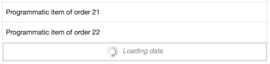

# deliteful/list/PageableList

The `deliteful/PageableList` custom element (`d-pageable-list` custom tag) extends the [deliteful/list/List](./List.md) element 
and adds paging capabilities to it.

A pageable list does not load and display all its content all at once, but only loads and displays a subset of the content while providing user controls to load and display more data.


##### Table of Contents
[Element Instantiation](#instantiation)  
[Element Configuration](#configuration)  
[Element Styling](#styling)  
[User Interactions](#interactions)  
[Mixins](#mixins)  
[Element Events](#events)  
[Enteprise Use](#enterprise)  

<a name="instantiation"></a>
## Element Instantiation

See [`delite/Widget`](/delite/docs/master/Widget.md) for full details on how instantiation lifecycle is working.

### Declarative Instantiation

```html
<!-- A pageable list of categorized items that uses the default item renderer, -->
<!-- mapping the sales property of items to righttext, and using the -->
<!-- region property as the item category -->
<d-pageable-list height="100%" righttextAttr="sales" categoryAttr="region">
    <!-- Add the following items to the store -->
    { "label": "France", "sales": 500, "profit": 50, "region": "EU" },
    { "label": "Germany", "sales": 450, "profit": 48, "region": "EU" },
    { "label": "UK", "sales": 700, "profit": 60, "region": "EU" },
    { "label": "USA", "sales": 2000, "profit": 250, "region": "America" },
    { "label": "Canada", "sales": 600, "profit": 30, "region": "America" },
    { "label": "Brazil", "sales": 450, "profit": 30, "region": "America" },
    { "label": "China", "sales": 500, "profit": 40, "region": "Asia" },
    { "label": "Japan", "sales": 900, "profit": 100, "region": "Asia" }
</d-list>
```
### Programmatic Instantiation with a `dstore/Store` in source property

```js
require(["dstore/Memory", "deliteful/list/PageableList", "requirejs-domready/domReady!"],
  function (Memory, PageableList) {
  // Create a memory store for the list and initialize it
  var dataSource = new Memory({idProperty: "label", data:
    [
      { label: "France", sales: 500, profit: 50, region: "EU" },
      { label: "Germany", sales: 450, profit: 48, region: "EU" },
      { label: "UK", sales: 700, profit: 60, region: "EU" },
      { label: "USA", sales: 2000, profit: 250, region: "America" },
      { label: "Canada", sales: 600, profit: 30, region: "America" },
      { label: "Brazil", sales: 450, profit: 30, region: "America" },
      { label: "China", sales: 500, profit: 40, region: "Asia" },
      { label: "Japan", sales: 900, profit: 100, region: "Asia" }
  ]});
  // A pageable list of categorized items from dataSource, that uses the default item renderer,
  // mapping the sales property of items to righttext and using the region property
  // as the item category.
  var list = new PageableList({source: dataSource, righttextAttr: "sales", categoryAttr: "region"});
  list.style.height = "100%";
  list.placeAt(document.body);
});
```

<iframe width="100%" height="300" allowfullscreen="allowfullscreen" frameborder="0" 
src="http://jsfiddle.net/ibmjs/099c6dkk/embedded/result,js">
<a href="http://jsfiddle.net/ibmjs/099c6dkk/">checkout the sample on JSFiddle</a></iframe>

### Programmatic Instantiation with an array in source property

```js
require(["deliteful/list/PageableList", "requirejs-domready/domReady!"],
  function (PageableList) {
  // Create a memory store for the list and initialize it
  var dataSource =
    [
      { label: "France", sales: 500, profit: 50, region: "EU" },
      { label: "Germany", sales: 450, profit: 48, region: "EU" },
      { label: "UK", sales: 700, profit: 60, region: "EU" },
      { label: "USA", sales: 2000, profit: 250, region: "America" },
      { label: "Canada", sales: 600, profit: 30, region: "America" },
      { label: "Brazil", sales: 450, profit: 30, region: "America" },
      { label: "China", sales: 500, profit: 40, region: "Asia" },
      { label: "Japan", sales: 900, profit: 100, region: "Asia" }
    ];
  // A pageable list of categorized items from dataSource, that uses the default item renderer,
  // mapping the sales property of items to righttext and using the region property
  // as the item category.
  var list = new PageableList({source: dataSource, righttextAttr: "sales", categoryAttr: "region"});
  list.style.height = "100%";
  list.placeAt(document.body);
});
```

Note : When using array you must also define a function in respond of an event -> more details here :
[Element Events](#events)

<a name="configuration"></a>
## Element Configuration

See also [`deliteful/list/List` configuration](./List.md#configuration) for the element configuration inherited from the `deliteful/list/List` widget.

##### Table of content

- [Defining the length of pages](#pagelength)
- [Defining the maximum number of pages to display at once](#maxnbpages)
- [Hiding the list while it is busy loading and displaying a page of items](#hiding)
- [Other properties](#otherProperties)

<a name="pagelength"></a>
### Defining the length of pages

When started, a pageable list will load and display only one page of data, and will provide user controls to load and display more pages of data (if there is more data).

The `pageLength` property of a pageable list defines the number of items in a page of data. Note that this number is a maximum, and that a page may contain less items.

If this property is set to 0 or less, the list will load and display all the items from the source (as a non pageable list does).

Here is an example of setting a pageLength of 100 items:

```js
require([
    "deliteful/list/PageableList",
    "requirejs-domready/domReady!"
], function (PageableList) {
    var pageableList = new PageableList();
    pageableList.pageLength = 100;
    ...
    pageableList.placeAt(document.body);
});
```

Here is the same example using markup:

```html
<head>
    ...
    <script>
        require([
            "deliteful/list/PageableList",
            "requirejs-domready/domReady!"
        ], function (PageableList) {
        });
    </script>
</head>
<body>
    <d-pageable-list source="..." pageLength="100">
    </d-pageable-list>
</body>
```
In this example, the list will load (up to) the first 100 items from the source, display them, and provide user controls to load another page of (up to) 100 items if there are more items in the source.

<a name="maxnbpages"></a>
### Defining the maximum number of pages to display at once

The property `maxPages` defines the maximum number of pages to display at the same time, allowing to keep the size of the DOM under control when using very large lists of items.

When a pageable list loads and displays a new page of data, it makes sure not to display more pages than the maximum number of pages allowed by unloading some other pages.

Here is an example that illustrates the unloading mechanism, using a pageable list on a source of 1000 items, with a page length of 50 and a maximum number of 2 pages displayed at the same time:

1. Initially, the list loads and displays the 50 first items of the source (index 0 to 49), and creates a user control to load the following page;
1. When the user control is activated, the following 50 items (index 50 to 99) are loaded from the source and appended to the list (the list now displays the 100 first items from the source);
1. When the user control is activated once again:
	1. the following 50 items (index 100 to 149) are loaded from the source and appended to the list;
	1. the first page of items (index 0 to 49) is removed from the DOM, and a user control is created to load the previous page.

If the `maxPages` property is set to 0 or less, there is no maximum number of pages (pages are never unloaded).

<a name="hiding"></a>
### Hiding the list while it is busy loading and displaying a page of items

The pageable list provides the options to hides its content when loading a page of data. This is activated by setting the `hideOnPageLoad` property to `true`.

<a name="otherProperties"></a>
### Other properties

See the [User Interactions section](#interactions) for the other available properties of a pageable list.

<a name="styling"></a>
## Element Styling

### Supported themes

This widget provides default styling for the following delite themes:

* bootstrap

### CSS Classes

See also [`deliteful/list/List` styling](./List.md#styling) for the element styling inherited from the `deliteful/list/List` widget.

The CSS class of a page loader is `d-list-loader`.

When a page is currently loading, the CSS class `d-loading` is added to the page loader.

The progress indicator that is displayed when a page is loading can also be styled using CSS. See [Progress indicator styling](../ProgressIndicator.md#styling) for more details.

The following example demonstrate how to customize the progress indicator using CSS, so that both the progress indicator and the text are displayed in red:

```css
.d-list-loader {
    color: red;
}
.d-list-loader.d-loading {
    color: red;
}
.d-list-loader.d-loading .d-progress-indicator-lines {
    stroke: red;
}
```

<a name="interactions"></a>
## User Interactions

See also [`deliteful/list/List` user interactions](./List.md#interactions) for the user interactions inherited from the `deliteful/list/List` widget.

The list provides up to two user controls to load and display more data:

1. A user control to load the next page of data from the source. It is only present if there is more data to load from the source.
1. A user control to load the previous page of data from the source. It is only present if there is previous data to load from the source.

The user controls can be activated using one of the following interactions, as described in the next sections:

1. Activation with a mouse click / the keyboard SPACE key
1. Activation by scrolling

### Activation with a mouse click / the keyboard SPACE key

The user controls for loading pages are clickable (or activable using the SPACE key when navigating the list using the keyboard).

If there is a next page of data in the source, the user control is displayed at the end of the list:


The message that is displayed by the control can be customized using the `loadNextMessage` of a pageable List (see the API documentation for more information).

When the user control is activated, its appearance changes while the list is busy retrieving data from the source and displaying it:



The message that is displayed when the list is busy can also be customized, using the `loadingMessage` property of a pageable list.

When the new page of items is displayed, the first new item gains the focus and the user control is either deleted (if there is no more data in the source) or moved to the end of the list:


The user control to load the previous page of data follows the same pattern, except that it is displayed at the top of the list rather than at the end of the list,
and that the property `loadPreviousMessage` defines what it displays:


### Activation by scrolling

The user controls, when they exist, can be automatically activated when the user scrolls to the top of the bottom of the list.

To activate this behavior, the `autoPaging` property must be set to `true` on the pageable list.

<a name="mixins"></a>
## Mixins

See also [`deliteful/list/List` mixins](./List.md#mixins) for the mixins provided for the inherited `deliteful/list/List` widget.

No specific Mixin is currently provided for this widget.

<a name="events"></a>
## Element Events

See also [`deliteful/list/List` element events](./List.md#events) for the element events inherited from the `deliteful/list/List` widget.

In the case of one uses an array as the source, an event "new-query-asked" is emitted when all the items contained in the list
are displayed.
Also one must define the following function :

```js
require(["deliteful/list/PageableList", "requirejs-domready/domReady!"],
  function (PageableList) {
  // Create a memory store for the list and initialize it
  var dataSource = [...];
  var list = new PageableList({source: dataSource, righttextAttr: "sales", categoryAttr: "region"});
  list.on("new-query-asked", function(evt) {
    evt.setPromise(new Promise (function (resolve) {
    ...
    //return the elements asked by the query in the resolve promise (can be [])
    resolve(list.source.slice(evt.start, evt.end));
    }))
  });
  list.style.height = "100%";
  list.placeAt(document.body);
});
```

The event is send by the function fetchRange() of `delite/Store` which can not finish its execution until a promise is resolved.
One can use the function in response of the event to add items in the array and achieve the query.
The function must then use the function setPromise of the event in arguments and create a promise to resolve.
The promise resolved must return an array representing the items asked.

<a name="enterprise"></a>
## Enterprise Use

See also [`deliteful/list/List` enterprise use](./List.md#enterprise) for the enterprise use inherited from the `deliteful/list/List` widget.

### Globalization

`deliteful/list/PageableList` provides an internationalizable bundle that contains only one message, with the 
key `default-load-message`. This is the message displayed by page loaders.
This message supports the keyword `${pageLength}`, that is replaced by the current value of the `pageLength` property 
of the widget.

