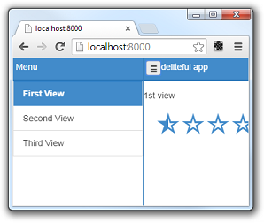
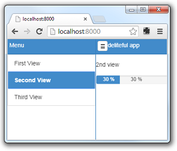
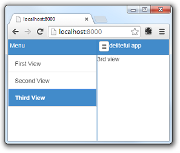

#Deliteful Tutorial (Part 2) - A Quick Look at Deliteful Components

In the [first step](Part1GettingStarted.md) of this tutorial we have setup the tools and created a first deliteful
application. Let's now go through the application source to get familiar with some deliteful components.

## HTML Markup

Let's first have a look at the HTML markup of our application.

```html
<!-- left menu side pane -->
<d-side-pane mode="push" position="start" id="leftPane">
...
</d-side-pane>
<!-- page content -->
<d-linear-layout class="page width100 height100">
...
</d-linear-layout>
```

The body contains two toplevel elements: `<d-side-pane>` and `<d-linear-layout>`. These are custom HTML elements
defined by deliteful (all deliteful components have a `d-` prefix).

Let's start with the second element. The `<d-linear-layout>` component is a container that stacks other elements
vertically or horizontally. It is used here to build the main page of the application.

```html
<!-- page content -->
<d-linear-layout class="page width100 height100">
	<!-- page content header -->
	<d-linear-layout vertical="false" class="pageHeader">
		<div><d-button iconClass="icon" class="toggle" on-click="leftPane.toggle()"></d-button></div>
		<div class="fill titleStyle">deliteful app</div>
	</d-linear-layout>
	<!-- stacked content -->
	<d-view-stack id="vs" class="fill">
		<div id="first">
			<!-- fill the first view with content -->
			<p>1st view</p>
			<d-star-rating value="0.5"></d-star-rating>
		</div>
		<div id="second">
			<!-- fill the second view with content -->
			<p>2nd view</p>
			<d-progress-bar value=30 max="100" essage="Uploading..." style="width: 50%"></d-progress-bar>
		</div>
		<div id="third">
			<!-- fill the third view with content -->
			<span>3rd view</span>
		</div>
	</d-view-stack>
</d-linear-layout>
```

Note the `width100` and `height100` CSS classes on the toplevel `d-linear-layout`,
they indicate that it should fill the whole width and height of the page. These classes are defined in the
[`defaultapp.css`](/delite/docs/master/defaultapp.md) style sheet that is included by the application generator.

The toplevel `d-linear-layout` element contains two children: another nested `d-linear-layout` element,
which will be the header of the page, and a `d-view-stack` element.

The nested `d-linear-layout` element has a `vertical="false"` attribute, which means that it will stack its children
horizontally. The children of the header are a button (nested inside a div) and another div that displays
the title text. The button has an `onclick` event listener to show/hide the side pane (see below).

The second child of the toplevel `d-linear-layout` element is a `d-view-stack` element. This is another deliteful
container that shows one of its children at time. In our default application it contains three `div`s,
one containing a deliteful `d-star-rating` element (visible on the first screen shot above),
a second one containing a deliteful `d-progress-bar` element, and a third one containing just standard HTML elements.

Let's go back to the first toplevel element of our application, the `d-side-pane` component. It is used to display
a sliding pane on the side of a main application view. It can be seen in action by clicking the top-left icon:



The `d-side-pane` contains elements with a similar structure as the main view, with a vertical `d-linear-layout`
containing a header (a nested `d-linear-layout`), but below the header we now have a deliteful `d-list`  element. The
`d-list` is an important deliteful component that displays a list of items.

```html
<d-side-pane mode="push" position="start" id="leftPane">
	<d-linear-layout class="height100">
		<!-- left menu header -->
		<d-linear-layout vertical="false" class="pageHeader">
			<div class="fill titleStyle">Menu</div>
		</d-linear-layout>
		<!-- left menu content -->
		<d-list id="list" on-selection-change="vs.show(event.newValue.id)" selectionMode="radio">
			{"label": "First View", "id": "first" },
			{"label": "Second View", "id": "second" },
			{"label": "Third View", "id": "third" }
		</d-list>
	</d-linear-layout>
</d-side-pane>
```

Note the `on-selection-change="vs.show(event.newValue.id)"` attribute on the `d-list`. It adds a event listener so
that when an element is selected in the list, one of the children of the `d-view-stack` in the main view is shown:

 

## CSS

As usual when creating web applications, the CSS part is also very important, so you can have a look at the
`css/app.css` file which contains the CSS rules that define the layout and style of the page elements.

Note in particular that all deliteful components have a CSS class with the same name as their HTML tag, for example:

```css
.d-side-pane {
	border-right: 1px solid #357ebd;
}
```

## JavaScript

The default application contains some JavaScript code that you can often reuse to get started.

```js
/* index.html */
require.config({
	baseUrl: "bower_components",
	paths: {
		"js": "../js"
	}
});
// Start the application.
require(["js/app"]);
```

The `require.config` calls tells the browsers where to find the various delite, deliteful and other libraries,
as well as the app in `js/app`.

The `require(["js/app"])` call loads the `js/app` AMD module which will be the application entry point.

```js
/* js/app.js */
define([
	"delite/theme!delite/themes/{{theme}}/global.css", "deliteful/ViewStack",
	"deliteful/SidePane", "deliteful/LinearLayout", "deliteful/Button", "deliteful/StarRating",
	"deliteful/ProgressBar", "deliteful/list/List", "requirejs-domready/domReady!"
], function () {
	document.body.style.display = "";
	list.selectedItem = list.source.get("first");

	/* app code will go here */

});
```

The `define` call loads the AMD modules containing the components used in the application.

The body of the application is initially hidden by a `display: none` style. This is a well-known technique to
make sure that the DOM will not be displayed before it is fully initialized by the delite/deliteful code. The
`document.body.style.display = "";` line makes the body visible once everything is correctly setup.

##Next Step

Now that you have a basic understanding of how to create a simple deliteful application,
let's move to the [next step](Part3PhotoFeedApp.md) where we will describe the application that we will create.

[Previous Step - Getting Started with Deliteful](Part1GettingStarted.md)

[Next Step - Introducing the Photo Feed Application](Part3PhotoFeedApp.md)
