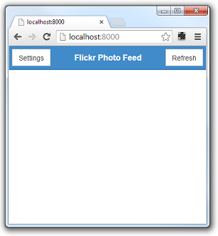
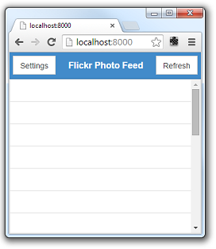
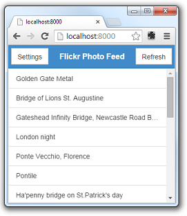

#Deliteful Tutorial (Part 4) - The Photo List View

We will now begin to create our [Flickr photo feed viewer application](Part3PhotoFeedApp.md).

It is time to open your favorite editor or IDE and load the `index.html` file of the application in it.

> If you have chosen to get the tutorial application from the `ibm-js/deliteful-tutorial` project,
switch to the `part4` branch now:
```
$ git checkout part4
```

##HTML and CSS

The layout of the default application that we generated using Yeoman is roughly similar to what we want: a header
on top, and contents that fit the remaining page space below. So we will keep the existing structure to make our list 
view, that is, a (vertical) `d-linear-layout` and another nested, horizontal `d-linear-layout` for the header.

Edit the contents of the `body` element as follows :

```html
<!-- left menu side pane -->
<d-side-pane mode="push" position="start" id="leftPane">
</d-side-pane>

<!-- page content -->
<d-linear-layout class="width100 height100" id="listView">
	<!-- view content header -->
	<d-linear-layout vertical="false" class="pageHeader">
		<div>
			<d-button on-click="leftPane.toggle()">Settings</d-button>
		</div>
		<div class="fill titleStyle">Flickr Photo Feed</div>
		<div>
			<d-button>Refresh</d-button>
		</div>
	</d-linear-layout>
	<!-- view content will go here -->
</d-linear-layout>
```

We have removed the contents of the left pane (we will fill it again later when we implement the Settings view),
changed some labels, set an `id` attribute on the view and added a second button after the title (the nested
`d-linear-layout` will automatically stack it on the right because the middle div has a `fill` class).

We also need to change the CSS, so open `css/app.css` in your editor. To keep things simple,
remove all the existing content and add these rules to define the look of our new header:

```css
.pageHeader {
    background-color: #428bca;
    color: white;
    height: 48px;
    border-bottom: 2px solid #357ebd;
    padding: 0.3em;
}
.titleStyle {
    text-align: center;
    line-height: 40px;
    font-weight: bold;
    font-size: 16px;
}
.d-button {
    border-radius: 0;
}
```

You can also remove Font-Awesome dependency from the bower.json as we won't use it in this tutorial.

If you open `index.html` in your browser now, you should get something like this:



A difference with the default application, though, is that in our case, we want a second view (the details view) to
completely replace the list view (including the header), whereas in the default application only the contents is
replaced and the header stays.

To achieve that, we will wrap our toplevel `d-linear-layout` inside a `d-view-stack`:

```html
<!-- page content -->
<d-view-stack class="width100 height100" id="vs">
	<d-linear-layout id="listView">
	...
	</d-linear-layout>
</d-view-stack>
```

(Note that we moved the `class="width100 height100"` to the toplevel `d-view-stack`)

Finally, we want to display a list of photos, so let's add a `d-list` component as the contents of our view.
For this, replace the `<!-- view content will go here -->` placeholder by a `d-list`.

```html
<!-- scrollable list -->
<div class="fill">
	<d-list class="width100 height100" id="photolist">
	</d-list>
</div>
```

Note our List widget has a `photolist` id, this will allow us to reference the widget in our JavaScript code later.

And also add this in `css/app.css` to ensure the list is correctly sized
(see [the LinearLayout doc](../LinearLayout.md#configuration)
for more details on why this is needed)

```css
#photolist {
    position: absolute
}
```

##Getting the Photo List from Flickr

It is now time to write some JavaScript code. 
 
Open `js/app.js` and let's remove things that we don't need: the `"deliteful/StarRating"` and
`"deliteful/ProgressBar"` modules and the last instruction:

```js
define([
	"delite/theme!delite/themes/{{theme}}/global.css", "deliteful/ViewStack",
	"deliteful/SidePane", "deliteful/LinearLayout", "deliteful/Button",
	"deliteful/list/List", "requirejs-domready/domReady!"
], function () {
	document.body.style.display = "";

	/* app code will go here */

});
```

To get the photos, we will use the
[Flickr API to retrieve photos feeds based on tags](https://www.flickr.com/services/feeds/docs/photos_public/).
We will request the photos in `json` format and use the [JSONP](http://en.wikipedia.org/wiki/JSONP) communication
technique. (JSONP is not very commonly used in real world applications, but it has the advantage of not requiring to
setup any server-side code, and it is good enough to simulate a server request in our example app).

Here is the code that does the JSONP request, use it to replace the
`/* app code will go here */` comment in `js/app.js`: 


```js
var script;

// Makes a request to the Flickr API to get recent photos with the specified tag.
// When the request completes, the "photosReceived" function will be called with json objects
// describing each photo.
function getPhotos(tags) {
	requestDone(); // abort current request if any

	var url = (window.location.protocol || "http:") +
		"//api.flickr.com/services/feeds/photos_public.gne?format=json&jsoncallback=photosReceived&tags=" +
		tags + "&tagmode=all";
	script = document.createElement("script");
	script.type = 'text/javascript';
	script.src = url;
	script.async = true;
	script.charset = 'utf-8';
	document.getElementsByTagName('head')[0].appendChild(script);
}

// Must be called to cleanup the current JSONP request (i.e. remove the "script" element).
function requestDone() {
	if (script && script.parentNode) {
		script.parentNode.removeChild(script);
		script = null;
	}
}
```

We won't go into the details of the code, but in short the `getPhotos` function sends a request to the Flickr server.
The URL contains the photo tags that we are interested in, and the name of a callback function to call when the
request completes. The reply sent by Flickr will be a JSON string containing a call to that function
(`photosReceived` in our case), with an array of JavaScript objects as parameter, each object describing a photo: the
URL of a thumbnail image, the photo title, etc.

##Displaying the Photo List

OK, that was the hard part! We would like to see something on the screen now, the good news is that it's really easy.
We have asked for a `photoReceived` global function to be called, so let's create it:

```js
photosReceived = function (json) {
	// cleanup request
	requestDone();
	// show the photos in the list by simply setting the list's source
	photolist.source = new Memory({data: json.items});
};

```

We must first call `requestDone()` (that's part of our quick JSONP implementation).

Then, we just set the `source` property of our `photolist` widget. The `source` property is a common property that
lets you connect data to many deliteful widgets. Deliteful has built-in connections to data stores defined by the
[dstore](https://github.com/SitePen/dstore) project. In our case, we will use a
[Memory](https://github.com/SitePen/dstore/blob/master/docs/Stores.md#memory) store that wraps JavaScript objects,
since that is what our JSONP request returned to us.

Note that you must also add `"dstore/Memory"` to the list of AMD dependencies and bind it to a `Memory`
parameter in the `define` callback:

```js
define([
	"dstore/Memory", ...
], function(Memory) {
	...
```

We must now initiate the request somehow. Let's create a global function for this:

```js
refreshPhotoList = function () {
	photolist.source = new Memory();
	getPhotos("bridges,famous");
};
```

The `refreshPhotoList` function first clears the list then sends a new request (with hardcoded tags for now).
Let us add a call to the function now, so the photos are retrieved and displayed at startup.

```js
refreshPhotoList();
```

Let us also set a `click` handler on the "Refresh" button if the user wants to reload the photos:

```html
<d-button on-click="refreshPhotoList()">Refresh</d-button>
```

We can already try that and open `index.html` in a browser:



OK, we can see that our code works because the list is populated with items, but they are empty.
We just miss one piece: we need to tell the List widget what to display exactly. Our JSON
photo descriptions have a `title` property that we would like to display in the list. Again that's
very easy, just add a `labelAttr` attribute to the `d-list` element:

```html
<d-list class="width100 height100" id="photolist" labelAttr="title">
```

And here is the result:



##Run the Demo

Click here to see the live demo:
[Deliteful Tutorial - Part 4](http://ibm-js.github.io/deliteful-tutorial/runnable/part4/index.html)

##Next Step

We learned the basic techniques to connect a deliteful widget to data retrieved from a server. In the
[next step](Part5CustomRenderer.md), we will further customize our list view to enhance the display.

[Previous Step - Introducing the Photo Feed Application](Part3PhotoFeedApp.md)

[Next Step - Enhancing the List View](Part5CustomRenderer.md)
