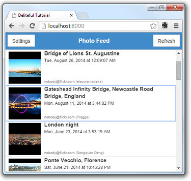
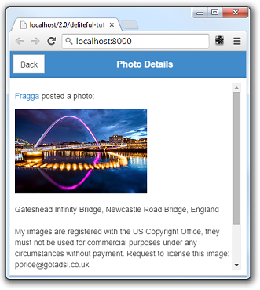

#Deliteful Tutorial (Part 6) - Adding a Details View

In the [previous step](Part5CustomRenderer.md) of the deliteful tutorial we enhanced the display of our photo list
view. We will now add a second view that shows the details of a photo. The details view will appear when we select
one of the items in the photo list.


> If you have chosen to get the tutorial application from the `ibm-js/deliteful-tutorial` project,
switch to the `part6` branch now:
```
$ git checkout part6
```

##Markup and CSS

As we have seen [previously](Part4ListView.md) or main view is made of a toplevel `d-view-stack` component which, so far,
contains only one view (the list view). The new details view will be added to this view stack,
so it can replace completely the list view:

```html
<!-- page content -->
<d-view-stack class="width100 height100" id="vs">
	<d-linear-layout id="listView">
	    ...
 	</d-linear-layout>
    <!-- details view -->
    <d-linear-layout id="detailsView">
        <!-- page content header -->
        <d-linear-layout vertical="false" class="pageHeader">
            <div>
                <d-button>Back</d-button>
            </div>
            <div class="fill titleStyle">Photo Details</div>
        </d-linear-layout>
        <!-- page content -->
        <div id="photoDetails" class="fill"></div>
    </d-linear-layout>
</d-view-stack>
```

The details view contains a header (implemented using a `d-linear-layout`, we are familiar with this already),
and a simple `div` that will contain the photo details.

Let's also add a little rule in `css/app.css` to set a margin on the details div and allow vertical scrolling on it:

```css
#photoDetails {
    margin: 9px;
    overflow-y: auto;
}
```

As we will rely on the List's selection to show the details view, we must set the List's `selectionMode` so that
items can be selected:

```html
<d-list ... selectionMode="single">
```

##JavaScript

Add this code to `js/app.js`:

```js
photolist.on("selection-change", function (event) {
	var renderer = event.renderer;
	if (renderer && renderer.item) {
		document.getElementById("photoDetails").innerHTML =
			renderer.item.description.replace(/href=/ig, "target=\"_blank\" href=");
		vs.show(detailsView);
	}
});
```

This code adds a `selection-change` event handler to the list. The handler first finds which item was selected (using
the
`renderer` property of the event) and accesses its data `item` (that is, the JavaScript object returned by
the Flickr query and that describes the photo). The item contains a `description` property that is an HTML fragment,
so it is really easy to populate the details view by setting the `innerHTML` property of the `photoDetails` div to
this description. We only change it slightly so that the anchors contained in the description open a separate window
instead of replacing our page.

Then, the important call is `vs.show(detailsView)`. The `vs` variable is our `d-view-stack` widget,
and it has a `show` function that makes one of its children visible. By default, the new view will be shown using a
slide transition, so that's OK for us.

We also want to be able to go back from the details view to the list view, and we added a Back button in the header
for this. let's just add an event handler in the markup to do this:

```html
<d-button on-click="vs.show(listView, {reverse:true})">Back</d-button>
```

We are done, you can try that new feature and click on an item to see the details view:

 

##Run the Demo

Click here to see the live demo:
[Deliteful Tutorial - Part 6](http://ibm-js.github.io/deliteful-tutorial/runnable/part6/index.html)

##Next Step

In the next step we will complete our small app by customizing the side pane to implement a
[settings view](Part7SettingsView.md).

[Previous Step - Enhancing the List View](Part5CustomRenderer.md)

[Next Step - The Settings View](Part7SettingsView.md)
