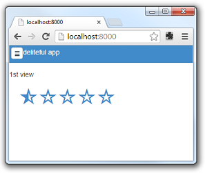

#Deliteful Tutorial (Part 1) - Getting Started with Deliteful

Welcome to [deliteful](http://ibm-js.github.io/deliteful/index.html), a set of multi channel,
enterprise class Web Components to be used in Web & Mobile Hybrid applications.

This tutorial is part of a series showing how to create a simple web application using the deliteful components.
In this first part, you will learn how to get started with deliteful and quickly create a basic web application
that can run both on mobile and desktop browsers.

##Installing Tools

Deliteful leverages some industry standard tools that you need to install.

###Node.js

All tools are JavaScript-based and run on top of Node.js, that you can install from [nodejs.org](http://nodejs.org/).

###Yeoman

[Yeoman](http://yeoman.io) is the tool that we will use to generate a basic skeleton for our application.
To install yeoman, run this in a shell window:

````
$ npm install -g yo
$ npm install -g generator-deliteful-app
````

##Creating the Application Skeleton

Create a directory of your choice, then run yeoman in it:

````
$ mkdir gettingstarted
$ cd gettingstarted
$ yo deliteful-app
````

Yeoman will ask you the name of your application, type `deliteful-tutorial` since this is what we will use throughout
 this tutorial.

````
[?] What is the name of your deliteful application package? deliteful-tutorial
````

##Deploying the Application on a Web Server

You need to deploy the application on a web server to be able to view it correctly in a browser.

If you already have a web server setup and you are familiar with deploying applications on it, you can skip this step.

Otherwise, a very easy way to deploy the application is to use the `local-web-server` npm package:

````
$ npm install -g local-web-server
$ ws
````

Now point your web browser to `http://localhost:8000`. You should see the application skeleton created by the Yeoman
generator:



Congratulations! You just created and deployed your first deliteful application.

##Running on a Mobile Device

Deliteful components are designed to run on mobile as well as desktop. You can run the application on a mobile
device, for this you just have to add some directives at the top of `index.html`:

````
<head>
    <meta name="viewport"
          content="width=device-width,initial-scale=1,maximum-scale=1,minimum-scale=1,user-scalable=no"/>
    <meta name="apple-mobile-web-app-capable" content="yes"/>
    ....
</head>
````

##Next Step

Before we start building our own app, let's now have a [quick look](Part_2_Quick_Look.md) at some deliteful components
that
make up this basic application.

[Next Step - A Quick Look at Deliteful Components](Part_2_Quick_Look.md)
