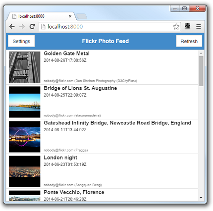
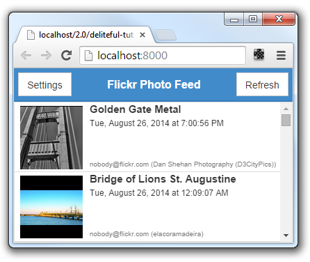
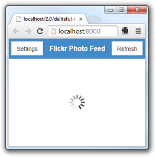

#Deliteful Tutorial (Part 5) - Enhancing the List View

In the [previous step](Part_4_List_View.md] of this tutorial we started to build our Flickr photo feed application.
We will now refine it to display more information for each photo. Remember, we wanted to obtain something like this:


##Defining a Custom List Item Renderer

The deliteful List widget can be customized to some extent, but for this we will need to define custom item renderer.
An item renderer is a subclass of `deliteful/list/ItemRenderer` that defines the content of each list item.

Add the following code in `js/app.js`, before the `refreshPhotoList()` call:

````
	photolist.itemRenderer = register("d-photo-item", [HTMLElement, ItemRenderer], {
		template: handlebars.compile("<template>" + "<div attach-point='renderNode'>" +
			"<div class='photoThumbnailBg'>" + "" + "</div>" +
			"<div class='photoSummary'>" + "<div class='photoTitle'>{{item.title}}</div>" +
			"<div class='publishedTime'>{{item.published}}</div>" +
			"<div class='author'>{{item.author}}</div>" + "</div>" + "</div>" + "</template>")
	});
````

This needs some explanations. The `itemRenderer` property of the deliteful List widget can be set to an instance of a
 subclass of `deliteful/list/ItemRenderer`. For each element of the data store, an instance of the renderer class
 will be created. The DOM contents of each item is defined by the `template` property,
 which is parsed and processed by the [handlebars](http://ibm-js.github.io/delite/docs/master/handlebars.html)
 module. The template can contain bindings: for example, `{{item.title}}` will be replaced by the value of the `title`
 property of each data item of the store.

In the added code we use two new AMD modules: `"deliteful/list/ItemRenderer"` (the base class of our
custom renderer) and `"delite/handlebars"` which contains the deliteful templating engine. Let's add them to our
require list:

````
require([
	"delite/register", "dstore/Memory", "deliteful/list/ItemRenderer", "delite/handlebars",
    ...
], function (register, Memory, ItemRenderer, handlebars) {
    ...
````

Add the following rules in `css/app.css` to style the item elements correctly:

````
.d-list-item .d-list-cell {
    line-height: 20px;
    height: 100px;
    width: 100%;
    overflow-x: hidden;
}
.photoThumbnailBg {
    width: 90px;
    height: 90px;
    min-width: 90px;
    background-color: #000000;
    text-align: center;
    line-height: 90px;
}
.photoThumbnail {
    max-width: 90px;
    max-height: 90px;
    vertical-align: middle;
}
.photoSummary {
    padding-left: 10px;
    padding-bottom: 0;
    margin: 0;
    position: relative;
    vertical-align: middle;
    height: 100%;
}
.photoTitle {
    font-size: 15px;
    font-weight: bold;
}
.publishedTime {
    font-size: 12px;
    font-weight: normal;
}
.author {
    font-size: 10px;
    color: #777;
    font-weight: normal;
    position: absolute;
    bottom: 0;
    text-overflow: ellipsis;
    white-space: nowrap;
}
````

We also need to modify the markup. We can remove the `labelAttr` that we added previously on the `d-list` element,
as the custom item renderer directly maps the data item properties to DOM properties in its template. In parallel,
we must set `copyAllItemProps="true"`, which means that all the properties of the data items will be available to the
custom item renderer.

````
    <d-list class="width100 height100" id="photolist" copyAllItemProps="true">
````

OK, let's try that, our list looks a lot better now:



##Formatting the Date

Flickr returns dates in ISO format, which is not very user friendly. We want to format this better,
and this is the opportunity to show that templates can contain any JavaScript expression. Let us add a function to
format a date:

````
	photolist.itemRenderer = register("d-photo-item", [HTMLElement, ItemRenderer], {
        ... ,

		// Formats a date in ISO 8601 format into a more readable format.
		formatDate: function (d) {
			return d && new Intl.DateTimeFormat("en-us", {
				year: "numeric",
				month: "long",
				day: "numeric",
				hour: "numeric",
				minute: "numeric",
				second: "numeric"
			}).format(new Date(d));
		}
	});
````

And we use yet another AMD module for this, the `"ecma402/Intl"` project for internationalization, let's add it:

````
require.config({
	...,
	config: {
		"ecma402/locales": ["en-us"]
	}
});
require([
	..., "ecma402/Intl", ...
], function (..., Intl) {
    ...
````

(Note we also added a `config` object to the `require.config` call to say which locales we are using,
`"en-us"` for now)

Now let's modify the template to use the `formatDate` function, for this we replace the `{{item.published}}` binding
by an expression:

````
			"<div class='publishedTime'>{{this.formatDate(this.item.published)}}</div>" +
````

(Note that, in binding expressions, `this` refers to the item renderer instance, and `this.item` is the data item
that the renderer represents. If you use a simple binding like `{{item.published}}`, you may omit the `this.` prefix,
 it is implicit).

OK, now our dates are formatted more cleanly:



##Adding a Progress Indicator

One last little thing we will do on this list view is to add a progress indicator that will spin while the request is
being processed. For this let's add this markup next to the `d-list` element:

````
        <!-- scrollable list -->
        <div class="fill">
            <d-list ...>
            </d-list>
            <d-progress-indicator id="pi"></d-progress-indicator>
        </div>
````

Add this rule to `css/app.css` to center the progress indicator in the view:

````
.d-progress-indicator {
    position: absolute;
    top: 0;
    right: 0;
    bottom: 0;
    left: 0;
    margin: auto;
}
````

Finally show the indicator in the `getPhotos` function, and hide it in `requestDone`:

````
	function getPhotos(tags) {
		requestDone();

	    pi.active = true;
        ....
    }

	function requestDone() {
	    ....
		pi.active = false;
	}
````

We now have a nice feedback to show that the request is being processed:



Our list view is now completed!

##Next Step

We will now learn how to add a [details view](Part_6_Details_View.md) that will show more details when a user clicks a
photo
in the list.

[Previous Step - The Photo List View](Part_4_List_View.md)

[Next Step - Adding a Details View](Part_6_Details_View.md)
